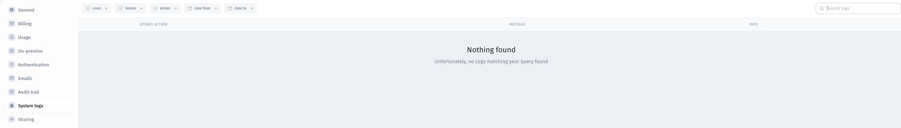

# 📖 Investigate system logs

Use system logs to investigate messages associated with app or integration problems.

## Find relevant messages

1. Open **More → System logs**.
2. Set **Date from** and **Date to** around the reported problem.
3. Narrow **Level**, **Source**, or **Action** as appropriate.
4. Use **Search logs** for a relevant term.
5. Review the source/action, message, and date of matching entries.

The screenshot shows an empty result. **Nothing found** means no entries matched the current view; it does not prove that the underlying operation succeeded.

## Troubleshoot an empty result

Check the app and environment, widen the date range, and remove unnecessary filters. Reproduce the issue with test data and note the exact time. If no relevant entry appears, investigate the identity provider, API, or resource involved as appropriate.

## Share useful diagnostics

Include the symptom, reproduction steps, approximate time with timezone, and redacted relevant message. Remove tokens, passwords, cookies, and customer data before sharing.

Use [the audit trail](review-the-audit-trail.md) for available user activity. Use [sign-in troubleshooting](../authentication-and-sso/troubleshoot-sign-in.md) when the issue occurs during authentication. Confirm retention and coverage for your deployment rather than assuming logs are permanent.
