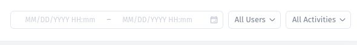

# Review the audit trail

Use the audit trail to inspect available activity in the app.

## Find activity

1. Open **More → Audit trail**.
2. On the **Activity trail** page, set the date and time range.
3. Use **All Users** to narrow the actor.
4. Use **All Activities** to narrow the event type.
5. Review the matching rows and use pagination for more results.

## Read a row

| Column   | What to inspect                                                                               |
| -------- | --------------------------------------------------------------------------------------------- |
| Date     | The recorded event time. Confirm the displayed timezone when correlating with another system. |
| User     | The actor shown for the event.                                                                |
| Activity | The event type.                                                                               |
| Details  | Available context, such as a resource or collection identifier.                               |

The activity selector includes event types for resources, collections, records, API tokens, backups, and codebase changes. Availability in the selector does not establish that every operation in every connected system is logged.

## Verify coverage for your use case

Perform a permitted test action on synthetic data, then check whether and how it appears. Confirm the event scope and retention before using the trail as an audit control.

For errors, switch to [System logs](investigate-system-logs.md). For an unexpected access change, compare the activity with [the intended access policy](../overview/test-access.md) and the actual user experience.
