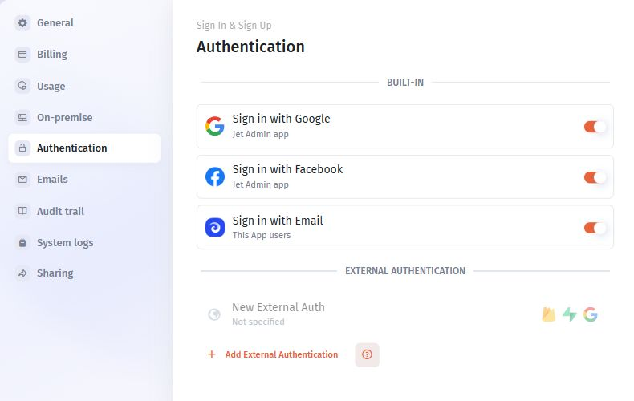
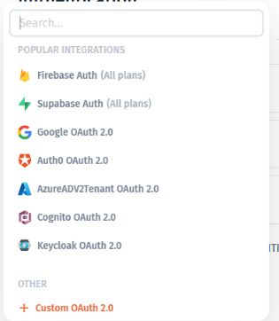

# Choose an authentication method

Choose the method that matches the identity system your app's users already have.

| Requirement                                | Start here                                                  |
| ------------------------------------------ | ----------------------------------------------------------- |
| Use built-in sign-in options               | [Jet Auth](jet-auth-and-built-in-sign-in.md)                |
| Use Firebase identities                    | [Firebase Auth](firebase-auth.md)                           |
| Use Supabase identities                    | [Supabase Auth](supabase-auth.md)                           |
| Use Auth0                                  | [Auth0](auth0.md)                                           |
| Use a company OAuth or SAML provider       | [App SSO](../sign-in-sign-up/)                              |
| Use an existing custom or token-based flow | [Token-based authentication](token-based-authentication.md) |
| Use Xano authentication                    | [Xano Auth](xano-auth.md)                                   |

## Open external authentication

1. Open **More → Authentication**.
2. Find **External Authentication**.
3. Select **Add External Authentication**.
4. Choose the provider that matches your identity system.
5. Follow its configuration form and the corresponding guide.

Use the callback or redirect values displayed for your own app. An example app's URL is not a substitute.

Open More → Authentication to find the built-in options and Add External Authentication.

Select the provider that matches your identity system; configure it using the values for your own app.

## Prepare the identity mapping

Before rollout, identify the account attribute used to match users, how users become members, how teams are assigned, and what happens to users who have no assignment.

Test these assumptions with an intended user and a user who should not receive access. Retain an existing working sign-in path until the new method and access rules are verified.
