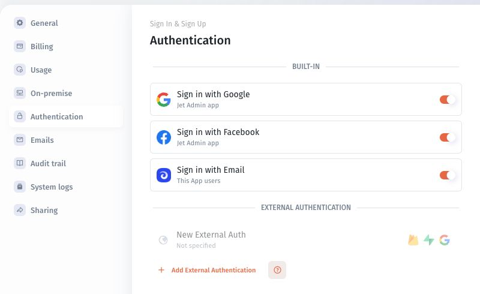

# Jet Auth and built-in sign-in

Review built-in sign-in options when you do not need to start with a separate identity-provider integration.

## Find the controls

1. Open **More → Authentication**.
2. Locate the **Built-in** section.
3. Review the sign-in options and their scope labels.
4. Configure the options intended for your app's audience.
5. Test the published app with a separate intended user.

The current screen shows:

| Option                | Scope label shown |
| --------------------- | ----------------- |
| Sign in with Google   | Jet Admin app     |
| Sign in with Facebook | Jet Admin app     |
| Sign in with Email    | This App users    |

Read the scope label before changing an option; the controls do not all describe the same audience.

## Verify before rollout

Confirm that the intended user can enter the published app and receives the expected team and permissions. Also test an account that should not receive access.

Keep a working administrator sign-in path while changing authentication. An enabled sign-in option is not evidence that every authenticated account should become an app member.

For onboarding, use [email invitations](../../members-users-and-groups/invite-by-email.md). For login failures, use [Troubleshoot sign-in](../troubleshoot-sign-in.md). For an external identity system, continue with [Choose an authentication method](./).
