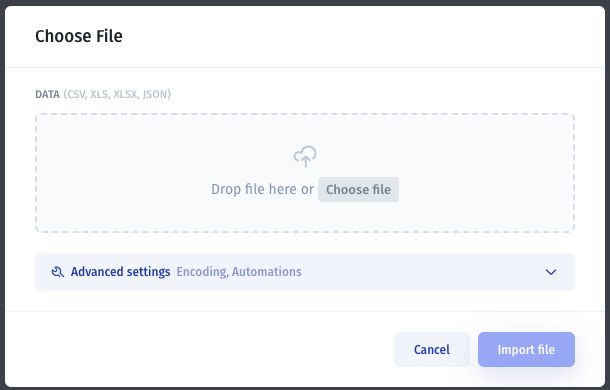

# Import and export users

Use **Import** and **Export** in **Users → Users** to work with user records in files.

## Import user records

1. Prepare a small sample file with clearly named columns and consistent values.
2. Select **Import**.
3. Choose or drop a **CSV, XLS, XLSX, or JSON** file.
4. Review **Advanced settings**, including the displayed **Encoding** and **Automations** options, when relevant to your file.
5. Follow the remaining file review controls and select **Import file** when the data is ready.
6. Search for the imported records and check their values before importing a larger file.

Test how duplicate emails, missing values, and team-related fields are handled with your sample. Do not assume an import sends invitations or grants the intended access. Verify membership and sign-in separately using [the invitation guide](invite-by-email.md).

## Export user records

1. Select **Export** in the Users list.
2. In **Records Export**, choose a format and review the displayed record count.
3. Select **Export** and inspect the resulting file.

The format selector offers **CSV, Excel (XLSX), Excel (XLS), JSON, HTML, and Notepad (TXT)**. Check the count rather than assuming an active search limits the export.

An export can contain personal information and access-related properties. Share it only with its intended recipients, and avoid treating it as a complete backup of authentication or permission settings.
