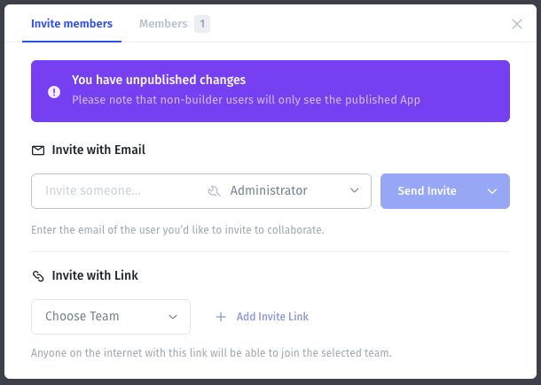

# Invite users with a link

Create a team-specific invitation link when everyone who receives that link should be able to join the selected team.

**Access behavior:** the invitation dialog states that anyone on the internet with the link can join the selected team. Choose the audience and team before generating or sharing it.

## Create the link

1. Open **Users → Users → Invite Member**.
2. Find **Invite with Link**.
3. Open **Choose Team** and select the intended team.
4. Select **Add Invite Link**.
5. Review the resulting link and its team before copying it to your intended audience.

For a named recipient, consider [an email invitation](invite-by-email.md) instead. Avoid distributing an Administrator invitation link for ordinary app onboarding.

## Verify the joining experience

Use an intended test account to open the link and complete joining. Confirm the team in the Users list, then test the published app with that account.

Do not assume that a link expires, has a usage limit, or stops working after you change a user's membership. Check the controls available for that link and test its behavior before relying on those properties.

Keep an owner and distribution record for shared links so access reviews include the ways new people can still join.
