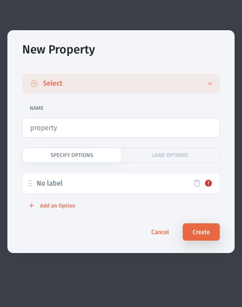

# User and team properties

Add attributes such as department, customer ID, or status to user and team records. A property stores a value; access changes only when a rule uses that value.

## Add a Select property

1. Open **Users → Users** for a user property, or **Users → Teams** for a team property.
2. Select **Add Property**.
3. Choose **Select** as the property type.
4. Set **Name** to Status.
5. Under **Specify options**, replace the blank option with Active.
6. Select **Add an Option** and add Inactive.
7. Select **Create**, then populate the values for the relevant records.

Use this as a data-model example. A Status value of Inactive does not automatically disable a user's account.

## Use properties in access rules

Define who can change properties used for authorization. A user should not be able to grant themselves access by changing their own customer ID or department.

Use stable identifiers, consistent types, and explicit behavior for missing values. If user and team properties use the same key, document which value the rule should use when they differ, then test that case.

For record restrictions, continue with [Restrict access to records](../app-and-data-permissions/record-access.md). For multiple customers, use [Separate customer data](../app-and-data-permissions/customer-data-isolation.md).

### Classic examples

Classic component visibility is covered in [hiding components](../../classic-app-builder/design-and-structure/components-visibility/conditional-visibility/), and the existing [customer portal guide](../../classic-app-builder/videos/build-apps-together/customer-portal.md) demonstrates separating data. Visibility rules still need separate authorization checks.
