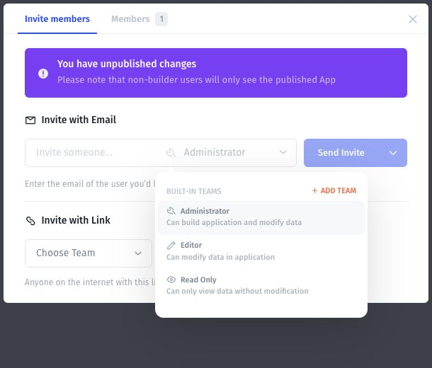

# Choose a built-in role

The invitation team selector describes three built-in teams. Use these descriptions to choose an initial access level.

| Built-in team | Description shown in the app            | Typical starting point                   |
| ------------- | --------------------------------------- | ---------------------------------------- |
| Administrator | Can build application and modify data   | People responsible for building the app. |
| Editor        | Can modify data in application          | People who work with app data.           |
| Read Only     | Can only view data without modification | People who need to inspect information.  |

These descriptions are a starting point, not a complete permission matrix for every page, API, workflow, or integration.

## Assign and verify

1. In **Users → Users → Invite Member**, open the team selector.
2. Choose the least access that supports the person's task.
3. Complete the invitation.
4. Test both an allowed action and a denied action using the resulting account.

For a Read Only test user, check that viewing intended records works and that create, update, and delete attempts are denied. For an Editor, verify permitted data changes and check whether builder or administration screens are accessible.

Use [the access test matrix](../overview/test-access.md) to record the result. If the observed behavior differs from the intended role, investigate the app's rules and other team assignments before sharing it more widely.
