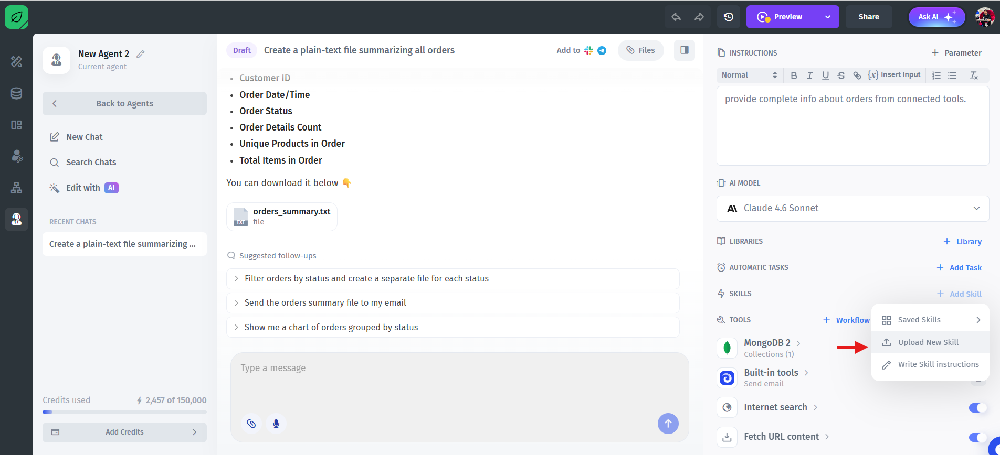

# Agent Skills

A skill can contain custom instructions, knowledge, or specialized behaviors that agents can use when responding to users.

Skills can be attached to multiple agents and managed centrally.

### Add a Skill

To add a skill:

1. Open your agent settings
2. In the right-side **Skills** section, click **Add Skill**




There are two ways to create a skill:

* Upload a skill file
* Write skill instructions manually


### Upload a Skill

To upload an existing skill:

1. Click **Upload Skill**
2. Select the skill file from your device

The skill will be uploaded and added to the agent.

<figure><figcaption></figcaption></figure>

### Write Skill Instructions

You can also create a skill manually.

Fill in the following fields:

| Field        | Description                                      |
| ------------ | ------------------------------------------------ |
| Skill Name   | Name of the skill                                |
| Description  | Short description of what the skill does         |
| Instructions | Detailed instructions and behavior for the skill |

After completing the fields, click **Create Skill**.

<figure><figcaption></figcaption></figure>


## Managing Skills

After creating a skill, you can:

* Add it to multiple agents
* Edit the skill
* Download the skill
* Replace the skill file
* Delete the skill


### Using Skills in Agent Instructions

After attaching a skill to an agent, you should define in the agent instructions:

* When the skill should be used
* How the skill should be used
* Which types of requests should trigger the skill

This helps the agent understand when to apply the connected skill during conversations.

> **Best Practice**
>
> Keep skill instructions focused and specific.\
> Clearly describing when a skill should be used improves agent reliability and response quality.
