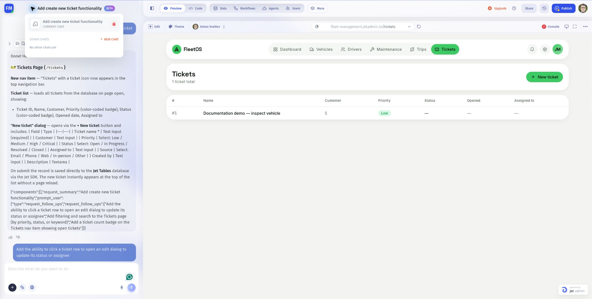

# Manage chats and context

Create as many chats as you need to organize app-building tasks. Use one conversation for a coherent task, such as building the Tickets page, and another for a separate task, such as styling.

## Create a chat

1. Open the chat menu beside the current conversation title.
2. Select **New chat**.
3. State the task and include its relevant context: page, resource, fields, and expected result.
4. Continue with focused follow-up requests in that conversation.

## Return to a conversation

Open the chat menu and select the earlier chat. Read its recent messages before continuing, especially if the app has changed since you last used it.

## Keep context clear

A chat's conversation history helps you continue that discussion. A separate chat should start with the information needed for its own task. Do not rely on instructions or attachments from another conversation being available automatically.

Chats organize conversations about the app. Do not use a new chat as a substitute for a separate test environment or as a way to isolate app changes.

For a new styling chat, start with:

> We are working on the existing Tickets page. Improve the spacing around the table. Keep its data source, actions, and permissions unchanged.

Unlimited chats does not mean unlimited AI usage or that every previous message fits into every model request. See the account's credit guidance for usage.

Next: [Request focused changes](../refine-an-app/request-focused-changes.md).
