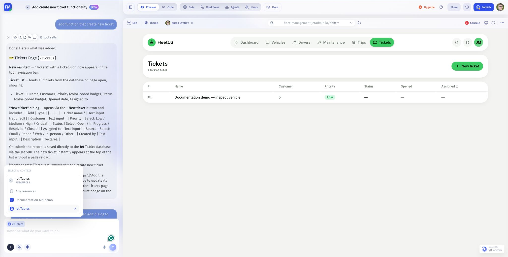

# Select data sources

Select the connected resources the AI Assistant should use as context for your request.

## Before you begin

Connect the source to your project and check that its tables and fields are available. If it is not connected yet, follow [Connect existing data](../create-an-app/connect-existing-data.md). Selecting a resource for the assistant does not create a connection or change its permissions.

## Select a resource

1. In the assistant's message composer, click the **+** control, labeled **Select AI context**.
2. Open **Resources**.
3. Choose the connected resource you want to use. The menu also offers **Any resources**.
4. Check the resource label above the message input.
5. Write your request using the actual table and field names, then send it.

For example:

> Use Tickets from Jet Tables. Show Name, Priority, Status, and Assigned to on a Tickets page. Start with a read-only list.

## Check the result

Compare a displayed ticket with its source record. Confirm the app uses the intended resource, not a similarly named table elsewhere.

If a resource is missing, check the project's **Data** area and your access to the connection. If a field is missing, inspect the schema before asking the assistant to use it.

Next: [Write your first prompt](../create-an-app/write-a-useful-prompt.md).
