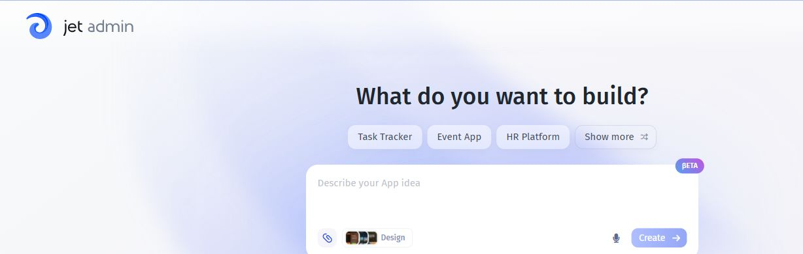

# Create an app

Start with one useful job and a small dataset. Build the first version, check its behavior, and then add capabilities.

1. Follow Build your first app with AI for a complete ticket-list example.
2. Connect existing data or prepare tables in Jet Databases.
3. Select the resource for the assistant.
4. Write your first prompt with the users, fields, screens, and actions.
5. Review the assistant's proposed plan and request any corrections before confirming generation.
6. Wait for generation to finish, then review the generated pages and logic.

You can also attach files to your initial prompt, such as a CSV with starting data or an image showing the intended layout. Ask for a CSV import into Jet Tables when you want the file's rows to become app data. These assistant features are in development preview.

The dashboard prompt is the starting point for a new app. Choose a design before submitting your description.

## Review the plan before building

In the builder preview, planning and generation follow separate steps. For an app based on an existing resource, the assistant requests access and inspects the resource before preparing the plan.

Check the proposed pages, data sources, actions, and user access. Confirm the plan when it matches your request. If the plan is incomplete, ask for a complete summary before approving it. Preview starts after the initial generation finishes.

## Choose a design or start from a template

Use the design picker alongside the creation prompt to choose your app's visual style. The selected design also guides later assistant edits.

An app template provides an existing app structure to build on. Select an available template, wait for it to be applied and Preview to load, then describe the changes you need. Template file copying and preview startup have been optimized to reduce this wait; startup time still varies by app.

Use Example apps and prompts for other starting points. Add automation after the basic app works, using a defined workflow for repeatable steps or an AI agent for tasks that require reasoning over context.

Before sharing the app, test data actions and user access.
