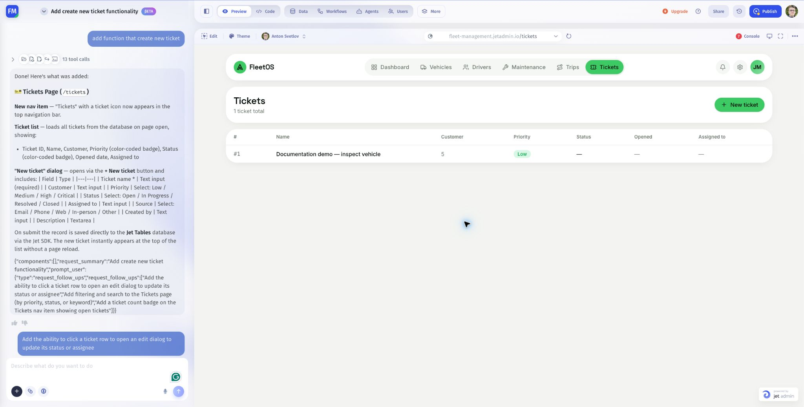

# AI App Builder overview

Build an app by describing the job, selecting its data, and reviewing the result in Preview. Use the AI Assistant for requests and follow-up changes, then test the app with the people and devices it is intended for.

Start with [Build your first app with AI](../getting-started/start-here.md).

## Find your way around

| Area             | What you can do                                                                                  |
| ---------------- | ------------------------------------------------------------------------------------------------ |
| AI Assistant     | Select data sources, attach images and files, choose a model, type or dictate, and manage chats. |
| Page selector    | Open a page from the app's page list.                                                            |
| Edit             | Select an element in Preview and describe a focused change.                                      |
| Theme            | Apply a preset or customize typography, colors, borders, and spacing.                            |
| User selector    | Preview the app as a specific invited user.                                                      |
| Preview controls | Switch Desktop, Tablet, and Mobile sizes; expand full screen; stop or restart Preview.           |
| Console          | Read logs and investigate errors.                                                                |
| Publish          | Release the reviewed app.                                                                        |

## Follow a learning path

1. [Learn the AI Assistant controls](ai-assistant/).
2. [Create an app](create-an-app/) from a clear task and connected data.
3. [Navigate and edit your app](refine-an-app/).
4. [Choose its theme and appearance](themes-and-appearance/).
5. [Preview and troubleshoot](preview-and-troubleshoot/).
6. [Test and publish](test-and-publish/).

For a complete example, use [Build a support dashboard](practical-guides/build-a-support-dashboard.md). Existing drag-and-drop projects are covered in [Classic App Builder](../classic-app-builder/maintain-an-existing-classic-app.md).

Screenshots show the September 2026 builder. Generated layouts and available controls may differ between projects.
