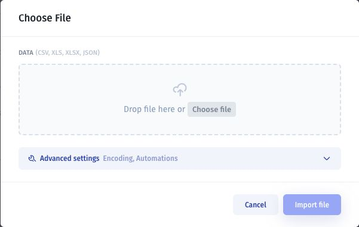

# Turn your spreadsheet into a real app

Give your team a focused way to work with spreadsheet data: searchable records, forms, detail pages, and access rules. Start with a customer list, inventory file, project tracker, or approval sheet, then build the screens people need to do their work.

This guide uses a customer tracker as an example. You will bring in the data, generate an app with AI, and test it before sharing.

## Choose where your data will live

| Starting point                      | Best when                                                 | How to begin                                                                              |
| ----------------------------------- | --------------------------------------------------------- | ----------------------------------------------------------------------------------------- |
| Import Excel or CSV into Jet Tables | You want Jet Tables to hold the working data              | Use **Import from File** for CSV, XLS, or XLSX.                                           |
| Attach a CSV to the AI prompt       | You want the assistant to help import and map the columns | Attach the file and ask for a Jet Tables import. This workflow is in development preview. |
| Connect Google Sheets               | Your team still needs to maintain the spreadsheet         | Connect the sheet as a resource and select it for the assistant.                          |

A file import creates a copy of the data in Jet Tables. Later edits to the original spreadsheet do not automatically update that copy. Choose one working source so your team knows where to make changes.

For a connected sheet, check the available read and write actions and sync behavior for your connection before relying on updates in either direction.

## 1. Prepare your spreadsheet

Start with one sheet containing one kind of record, such as customers.

* Put column names in a single header row.
* Use one row per customer and one value per cell.
* Remove merged cells, blank header columns, and totals rows from the data range.
* Use consistent date formats and status values.
* Keep a copy of the original file.

For this example, use these columns:

| Column         | Example                  | Purpose                                               |
| -------------- | ------------------------ | ----------------------------------------------------- |
| Customer name  | Acme Studio              | Identify the customer                                 |
| Email          | alex@example.com         | Contact email                                         |
| Company        | Acme                     | Company name                                          |
| Status         | Active                   | A consistent choice such as Lead, Active, or Inactive |
| Owner email    | sam@example.com          | Identify the person responsible                       |
| Next follow-up | 2026-10-05               | A date for follow-up work                             |
| Notes          | Asked for a product demo | Additional context                                    |

Keep an existing customer identifier if you use it to match records. Jet Tables also uses an **id** primary key to identify each record.

Do not assume spreadsheet formulas, macros, formatting, or relationships will become app logic during import. Identify the calculations and business rules you want to recreate, and include them in your prompt.

## 2. Bring in the data

### Option A: import Excel or CSV manually

1. Open **Data** and add a **New Data — using Jet Tables** resource, or select an existing Jet Tables resource.
2. Open the table setup window and choose **Import from File**.
3. Choose your CSV, XLS, or XLSX file.
4. Review the available import settings and select **Import file**.
5. Inspect the resulting table and use **Customers** as its name.

Compare record counts and check dates, numbers, blank values, and field types. See [Import and export data](../../user-guide/jet-databases/import-and-export-data.md) for the full workflow.

### Option B: import a CSV with the assistant


Initial-prompt attachments and the assistant's collection import tool are development previews.


Attach the CSV when creating the app, or in an existing app's chat. Name the target collection and explain whether you want to add records or replace existing data.

> Import the attached customers.csv into a new Customers table in Jet Tables. Map Customer name to Name and Next follow-up to a date field. Keep Owner email as a separate field. Use the file's records without adding sample customers. Show me the import count and any errors.

The assistant can inspect the columns, map different field names, and use the bulk import tool. Review the action details and check the resulting records before continuing.

See [Upload images and files](../ai-assistant/upload-images-and-files.md) for attachment instructions.

### Option C: keep Google Sheets connected

Connect your sheet through the [Google Sheets integration](../../classic-app-builder/videos/connecting-data-sources/google-sheet.md), then [select the data source for the assistant](../ai-assistant/select-data-sources.md).

Tell the assistant to use that resource and worksheet. Verify that the app displays the correct rows. If the app will edit the sheet, test one permitted update and check the result in the source.

## 3. Describe the app you want

Once the data is available, give the assistant the exact resource and table name, who will use the app, and what they need to do.

Copy and adapt this prompt:

> Build an internal customer-tracking app using the Customers table in my Jet Tables resource.
>
> Create a searchable customer list with Name, Company, Status, Owner email, and Next follow-up. Add filters for Status and Owner email.
>
> Clicking a customer should open a detail page with their contact information, notes, and follow-up date. Add forms to create a customer and edit an existing customer.
>
> Add a dashboard showing the number of customers by status and customers whose follow-up date is overdue. Calculate these values from the connected data.
>
> Require a customer name and validate email and date inputs. Use the existing records without generating extra sample data.
>
> Managers should be able to view and edit all customers. Staff should only access customers assigned to their signed-in email. Configure the data permissions needed for this rule, and tell me what still needs manual setup.

If you connected Google Sheets, replace the Jet Tables reference with your resource and worksheet names.

## 4. Review the app and refine one part at a time

Check that the screens use your data and that forms save to the intended source.

| Spreadsheet task            | App behavior to check                                 |
| --------------------------- | ----------------------------------------------------- |
| Find a customer             | Search and filters return the correct records         |
| Review a customer's history | The detail page opens the selected customer           |
| Add or update information   | Forms write the intended fields to the correct record |
| Track work due              | Follow-up views use the right date and status rules   |
| Check totals                | Dashboard values match the source data                |

Make focused follow-up requests:

> Add a Needs follow-up view for customers with a Next follow-up date before today. Exclude customers whose Status is Inactive.

> Move Notes below the contact details. Keep the data connection and save action unchanged.

Use [Edit components in Preview](../refine-an-app/edit-components-in-preview.md) for visual adjustments and [Themes and appearance](../themes-and-appearance/) for the app's overall appearance.

## 5. Configure access and test it

A prompt describes the intended access model. Verify the configured rules before inviting your team.

1. Configure [App and data permissions](../../access-and-sharing/app-and-data-permissions/).
2. Sign in as a manager and check the allowed records and actions.
3. Sign in as a staff member and check that only assigned customers are accessible.
4. Try opening another staff member's customer directly. The data access rule should deny it.
5. Create or update a test customer and inspect the source to confirm the result.

Hiding a page or filtering a visible list is not sufficient to enforce record access. Follow [Test data actions and user access](../test-and-publish/check-data-actions-and-user-access.md) to check the underlying behavior.

## 6. Add reminders when the core app works

For example, configure a scheduled workflow to find overdue follow-ups and notify the responsible person. Define who receives the reminder, when it runs, and which records qualify.

Start with [Send scheduled reminders](../../workflow/practical-guides/send-scheduled-reminders.md). Test with a controlled recipient before enabling notifications for your team.

## 7. Publish and share

Before publishing, confirm that:

* Imported counts and important field values match the spreadsheet.
* Create and edit forms save to the right source.
* Required fields and invalid values behave as expected.
* Each user role has the intended data access.
* Key screens work on desktop and mobile.
* Any notifications reach the intended recipients.

Follow [Preview and publish an AI app](../test-and-publish/preview-and-publish-an-ai-app.md), then invite the intended users and test the published app with their roles.

## Common questions

### Can I keep using the original spreadsheet?

Yes, if you choose a connected Google Sheets resource and verify the connection's behavior. With a one-time file import, the original file and Jet Tables are separate copies.

### What happens to my formulas?

Treat the import as a data import. Ask the assistant to recreate needed calculations or workflows, then compare the results with your spreadsheet. Do not assume workbook formulas or macros transfer automatically.

### What if my column names do not match the table?

The assistant import tool can map different names. Specify any important mappings in the prompt and review the import action details.

### Can I add another spreadsheet later?

Yes. Decide whether it belongs in a new table or should add records to an existing one. Specify how to handle existing records and duplicates before importing, and check the result before retrying a failed import.

### What else can I build?

Use the same process for an inventory tracker, project dashboard, or approval app. Describe the records, actions, and access rules for your case. See [Build an approval app](build-an-approval-app.md) and [Build a customer portal](build-a-customer-portal.md) for further examples.
