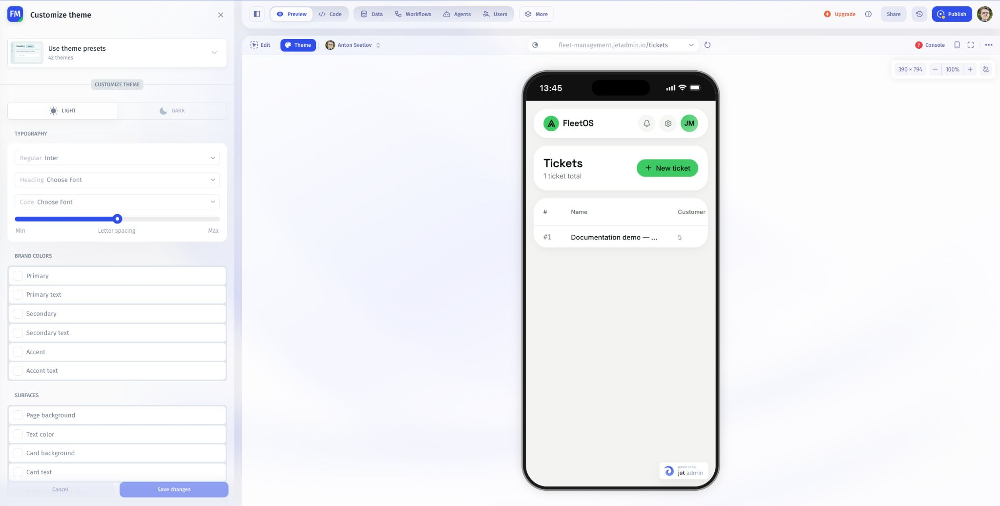
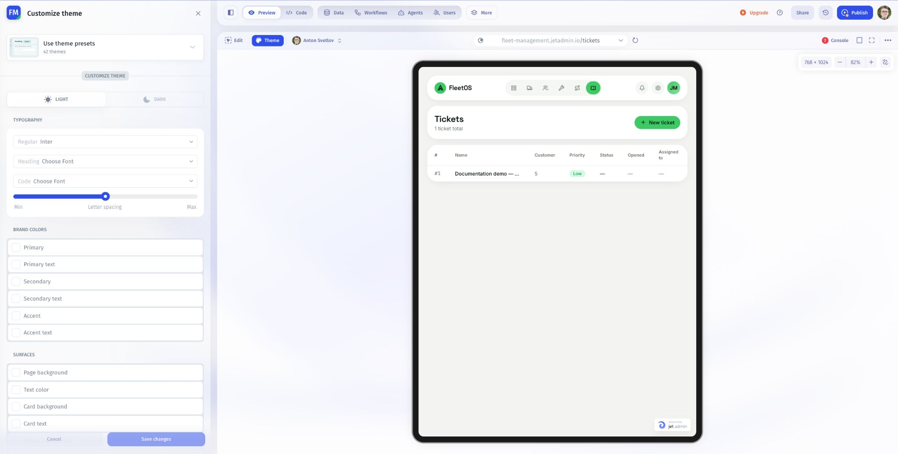
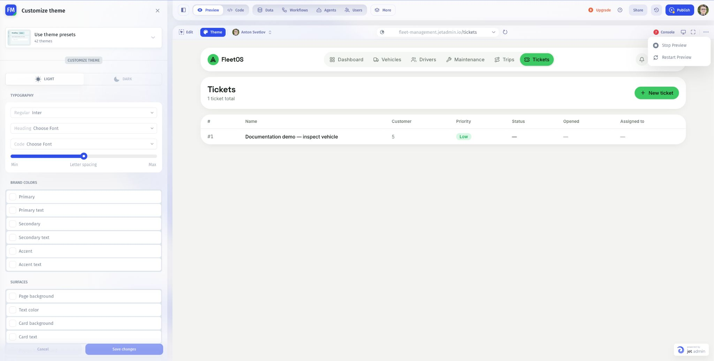

# Control app Preview

Use the toolbar above Preview to check screen sizes, expand the app, and control its preview session.

## Desktop, Tablet, and Mobile

1. Open the device menu near **Console**.
2. Choose **Desktop**, **Tablet**, or **Mobile**.
3. Inspect the same page at each size.
4. Check navigation, tables, forms, dialogs, and long labels.

A device preview helps find layout problems. Also test important interactions on the actual devices and browsers your users use.

## Full screen

Click the full-screen icon beside the device control to expand Preview. Use the full-screen control again to return to the builder layout. Full screen expands your working view; it does not publish the app.

## Stop and restart

1. Save or finish any in-progress form work.
2. Open the **…** menu at the right of the Preview toolbar.
3. Choose **Stop Preview** to stop the preview session, or **Restart Preview** to start it again.
4. After a restart, wait for the app to load and reopen the page you were checking.

Treat unsaved form input and temporary UI state as disposable during a restart. Restarting Preview is not a way to undo changes already saved to a connected data source.

## If Preview does not recover

Capture the error and check [Console and logs](inspect-app-console-and-logs.md). Record the route and the last action. Avoid repeating a write action until you know whether it completed.

Next: [Preview as an invited user](preview-as-an-invited-user.md).
