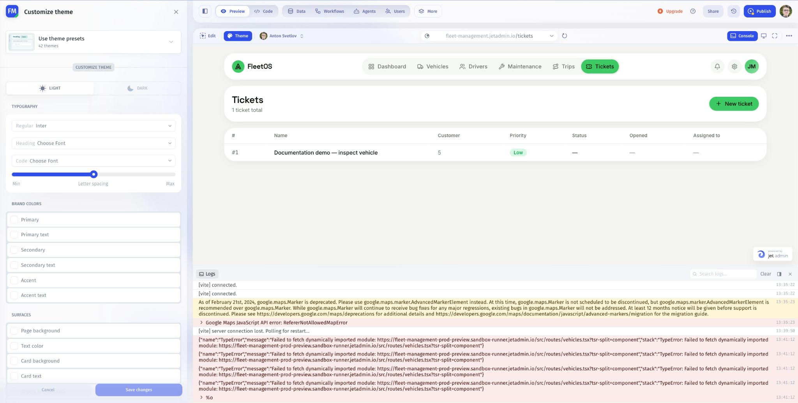

# Inspect App Console and logs

Open **Console** to inspect Preview logs when a page fails to load or an interaction behaves unexpectedly.

## Investigate a problem

1. Open the affected page in Preview.
2. Click **Console** in the Preview toolbar.
3. Note the most recent messages and their timestamps in **Logs**.
4. Reproduce the problem once with a safe input.
5. Use the search field to narrow the displayed messages.
6. Expand a relevant entry where more detail is available.

Capture the useful error details before using **Clear**. Clearing the display is a way to reduce noise, not a fix for the underlying problem.

## Turn an error into a focused request

Include the page, the action, the expected result, and the relevant error:

> On the Tickets page, submitting the test form fails. I expected one new ticket. Here is the error and the input I used. Identify the cause before changing other pages.

Remove credentials, tokens, and private record content from logs before sharing them.

## Check the fix

Repeat the original interaction with a test record. Confirm both the app result and the source data. Before retrying a create or send action, check whether the first attempt already completed.

For workflow execution details, use the workflow run logs. For project activity, use audit logs; Preview Console is not a substitute for either.

Next: [Troubleshoot the AI Assistant](troubleshoot-the-prompt-assistant.md).
