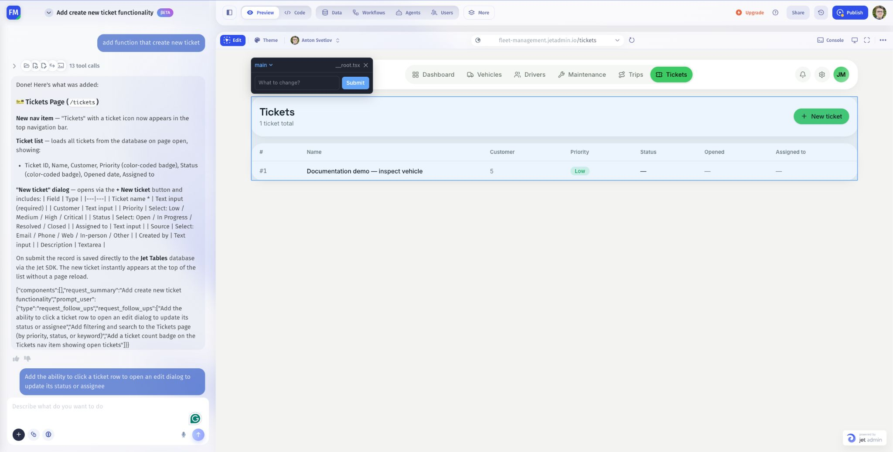

# Edit components in Preview

Select an element in the running app preview and describe the change you want to make to it.

## Before you begin

Open the correct page in Preview and wait for it to load. Identify a small change you can verify, such as a label or spacing adjustment.

## Select and change an element

1. Click **Edit** in the Preview toolbar.
2. Click the element or component in the preview.
3. Inspect the highlighted area. Make sure it covers the part you intend to change.
4. In **What to change?**, enter a focused instruction.
5. Click **Submit** and wait for the change to finish.
6. Leave Edit mode and check the result in the app.

> Change the Tickets heading to Support tickets. Keep the ticket table, data source, and actions unchanged.

The selected area can be a containing region rather than a single text label. Be explicit about the element and the scope of the change.

## Check the result

Verify the requested change, then check the nearby controls still work. For a form or action, test with a safe record.

If the wrong region is selected, close the selection and select again. For behavior that spans several components, use [a focused chat request](request-focused-changes.md) and name the affected page.

Next: [Themes and appearance](../themes-and-appearance/).
