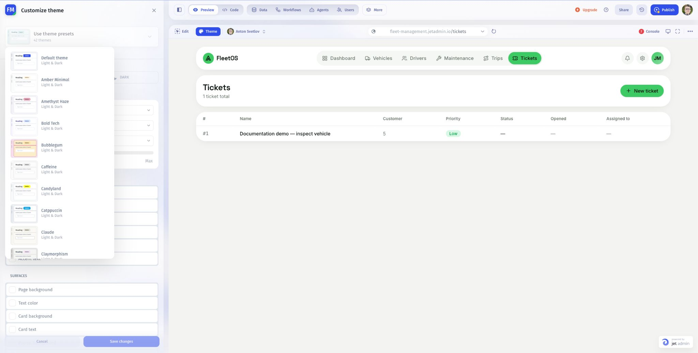

# Apply a theme template

Choose a preset to give your app a coordinated set of visual settings. The theme picker shows the presets available in your builder.

## Apply a preset

1. Open **Preview**, then click **Theme**.
2. In **Customize theme**, open **Use theme presets**.
3. Browse the preview cards and choose a preset.
4. Review its appearance in the app, including light and dark variants where used.
5. Click **Save changes** to keep your theme settings.

## Check the result

Open a page with text, buttons, fields, and status labels. Make sure the chosen colors and typography remain readable. Check that long labels fit at mobile width.

The screenshot shows the library available when it was captured; the preset count can change.

If a particular component does not follow the theme, inspect that component's styling and request a focused correction. Avoid assuming a preset will override every custom style in a generated app.

Next: [Customize theme settings](customize-theme-settings.md).
