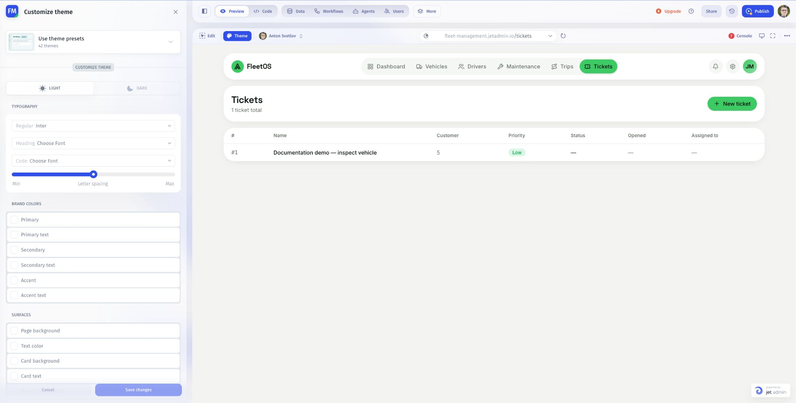

# Customize theme settings

Adjust theme parameters manually when you need a particular visual style. Start from a preset or work with the current settings.

## Change a setting

1. Open **Preview → Theme**.
2. Choose **Light** or **Dark** for the variant you are editing.
3. Find the setting you want to change.
4. Adjust it and inspect the relevant elements in Preview.
5. Click **Save changes** when the result is ready.

| Settings          | What to review                                                       |
| ----------------- | -------------------------------------------------------------------- |
| Typography        | Regular, Heading, and Code fonts; letter spacing                     |
| Brand colors      | Primary, Secondary, and Accent colors and their text colors          |
| Surfaces          | Page, card, popup, muted, and error/destructive backgrounds and text |
| Borders and focus | Border color, input border, and focus ring                           |
| Shapes            | Corner radius and spacing                                            |

## Check the result

Use a page with a table and form. Check body text, headings, input borders, keyboard focus, error text, and button labels. Review the other color mode separately.

For a targeted change, modify one group of settings at a time so you can see its effect. If you do not want to keep unsaved theme edits, use **Cancel**.

Next: [Control app Preview](../preview-and-troubleshoot/control-app-preview.md).
