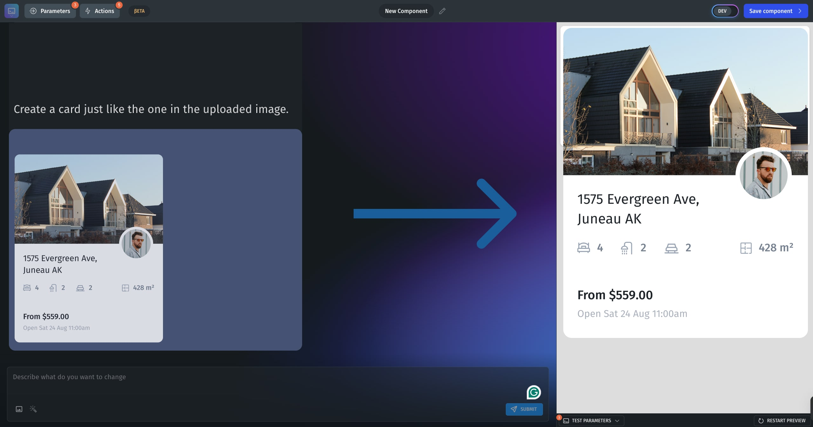

# Enhancing Your Prompts with Images

<figure><figcaption></figcaption></figure>

### How to Add an Image to Your Prompt

1.  **Write a Short Description**\
    Start by typing a simple explanation of what you want to create.\
    Example:

    > "A dashboard card for weekly sales numbers."
2. **Click the Image Upload Icon**\
   Inside the prompt box, click the **Image** icon.
   * Select an image file (JPG, PNG, or GIF) from your device.
   * It will attach directly to your prompt.
3.  **Add a Text Description for the Image**\
    After uploading, describe how the image should influence the component.\
    Example:

    > "Use the uploaded image as a background banner. Place the sales text data on top, left-aligned."
4. **Send Your Enhanced Prompt**\
   Submit your prompt with the attached image and description to the AI builder.




### 📋 Best Practices

**Always Add a Text Description**: Don’t rely on the image alone — explain what matters most.

**Focus on Important Details**: Mention layout, colors, or key elements if they are important.

**Use Clear, High-Quality Images**: Avoid cluttered or blurry files for better results.

