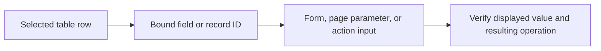

# Data binding and variables

Applies to **Classic App Builder**. Screens and recordings in this section show the Classic interface.

Binding connects a source value to a component, query, page parameter, or action input.

## Understand the flow

Selecting a different row should update the dependent value. Passing a displayed field and passing a stable record identifier are different choices; use the value required by the target.

## Start with an example

* [Binding components](binding-components.md) explains Bind and Functions.
* [Connect a table to an edit form](binding-form-to-table.md) follows a selected record into a form.
* [Connect a filter to a table](binding-filter-to-table.md) narrows visible results.
* [Bind related tables](binding-two-related-tables.md) connects related data.
* [Extract and pass values](parameters.md) covers component and page values.
* [Variables](variables.md) stores values used by app logic.
* [Bindings across pages](binding-across-pages.md) and [across overlays](binding-across-overlays.md) cover navigation boundaries.

## Verify a binding

Check the source component, selected record, field, and value type. Test a second selection, an empty selection, and a missing value. For writes, inspect the record identifier separately from the form's editable fields.

If the value is correct but the operation fails, investigate [the action and its inputs](../actions-and-logic/).
