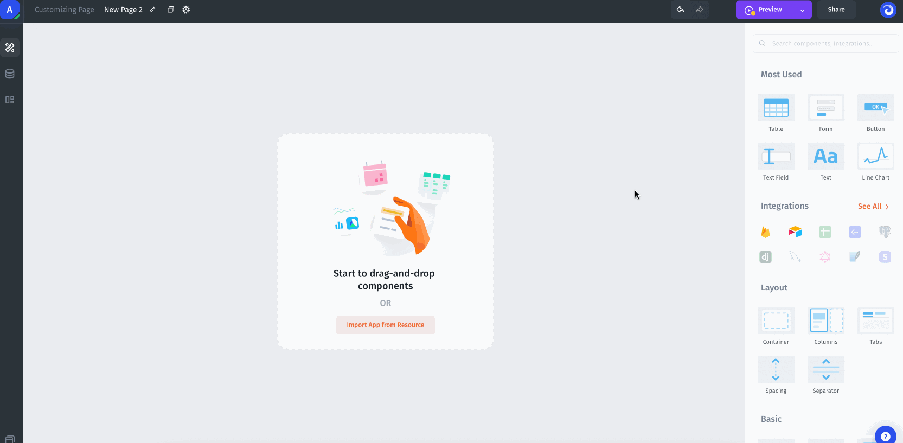
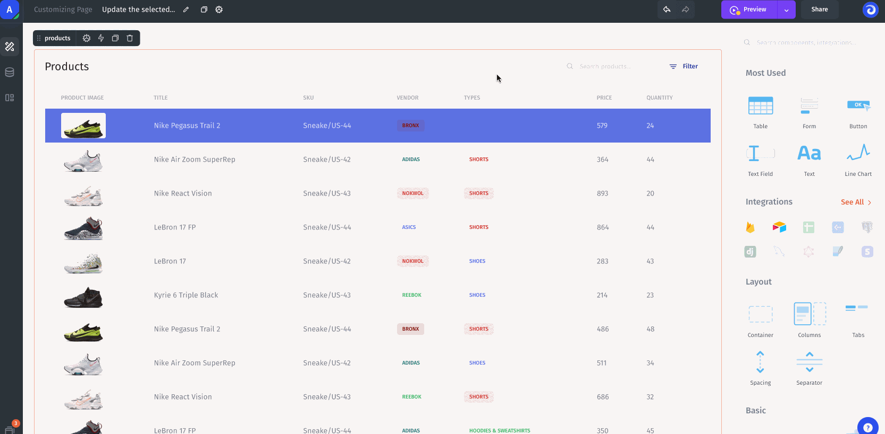
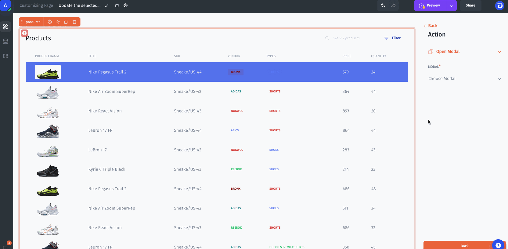
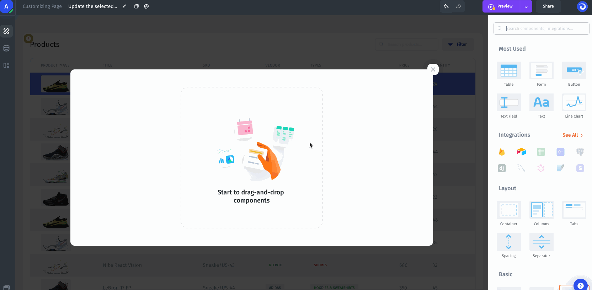
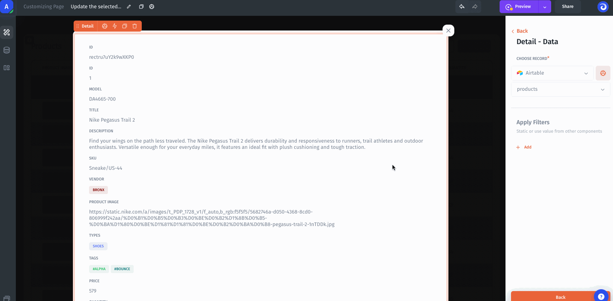
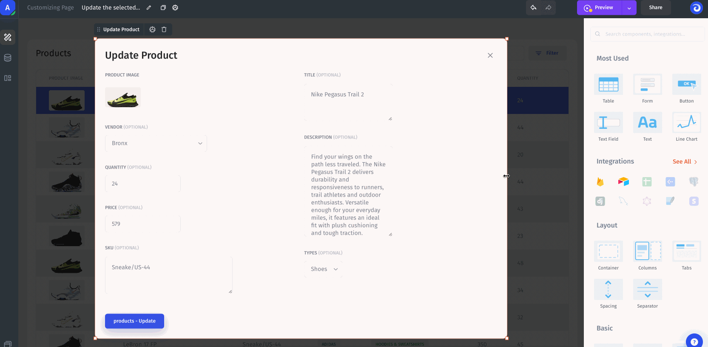
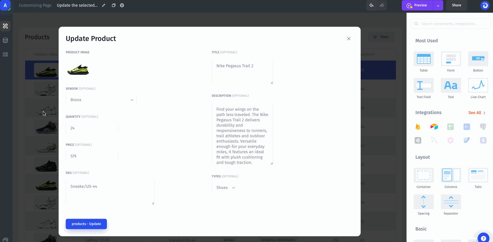
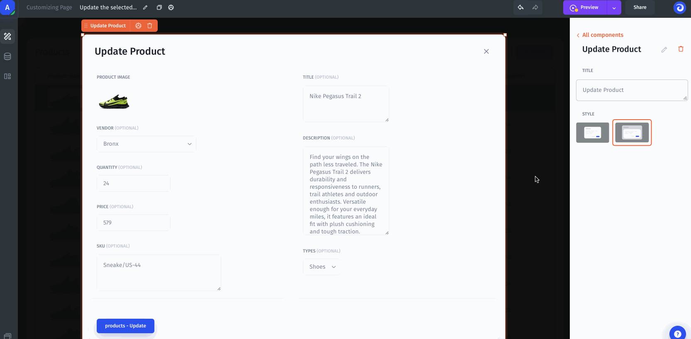
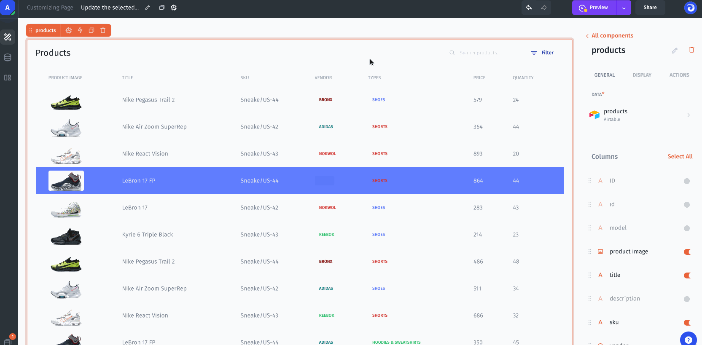

# Modals and overlays

Applies to **Classic App Builder**. A modal displays content above the current page; a slideout opens from the side, and a dropdown opens near its trigger. Use a modal to show record details or a form without navigating away.

This guide uses the existing Classic interface and media. For AI App Builder, use [focused edits in Preview](../../../ai-app-builder/refine-an-app/).

## Before you start

Have a Classic page with a table and a resource containing a unique record identifier, such as Product ID. Use test records to check your bindings before adding write actions.

## Create a modal

1. Open **Overlays** in the builder's top bar.
2. Select **+** beside the modal option. In earlier Classic layouts, drag **modal** or **slideout** from the component sidebar onto the page.
3. Open the overlay and add the components it needs: a Detail component for viewing a record, or inputs for a form.
4. Configure its title, width, and display style. A title can be static or use a dynamic value.
5. Close the overlay editor to return to the page. Reopen it through **Overlays** when you need to edit it.

.png>)

For the creation walkthrough and display options, see [Overlay layouts](layouts/overlays/) and [Customize an overlay](layouts/overlays/customizing-overlay.md).

## Open a modal when a table row is clicked

1. Select the table on the page.
2. Configure its **Row click** action.
3. Choose **Open Overlay** and select the modal you created.
4. Add a **Detail** component inside that modal and select the relevant resource.
5. Filter the Detail component by the record's primary key, binding the filter value to the selected table row's primary key.

For example: the table's selected Product ID is 42, so the Detail component must load the product whose ID equals 42. A matching name is not a substitute for a unique identifier.

**Expected result:** clicking a row opens the modal with that record's details. To show details only after a click, place the Detail component inside the modal rather than permanently beside the table.

## Open a modal from a button

Select the button, configure its action as **Open Overlay**, and choose the target modal. See [Configure a button action](../../classic-tutorials/configure-a-button-action.md).

For a button that depends on a selected row, ensure a row is selected before opening the modal. Pass the selected record identifier to the overlay and use it to load the intended record.

## Pass values into a modal or form

Use [Overlay Parameters](layouts/overlays/overlay-parameters.md) to pass contextual values from the page. Create a parameter of the appropriate type, supply its value in the action that opens the overlay, and bind the receiving component to it.

For a record-specific form, distinguish the identifier used to choose the record from editable input values. Opening the modal is not the same as submitting the form or updating the record.

See [Bind page data to a modal](../../binding-and-values/binding-across-overlays.md) for a worked example and the retained Classic video.

## Verify the result

1. Open record A and confirm its identifier and details.
2. Close the modal, then open record B and confirm the displayed data changes.
3. Check a row with an empty optional field.
4. For button-triggered overlays, check the behavior before a row is selected.
5. If you added a save action, test it separately with a synthetic record and verify the intended record changed.

Test with the intended user's permissions. A modal or hidden component does not itself enforce data access.

## Troubleshooting

| Problem                              | Check                                                                            |
| ------------------------------------ | -------------------------------------------------------------------------------- |
| Modal does not open                  | The trigger has an Open Overlay action and the correct target                    |
| A page opens instead                 | The trigger is configured for an overlay, not page navigation                    |
| Wrong record appears                 | The receiving component filters by the selected row's unique identifier          |
| Data stays the same between rows     | The parameter or filter is bound dynamically rather than to a copied fixed value |
| Details appear before clicking       | The Detail component is on the page instead of inside the overlay                |
| Modal opens but contains no data     | Resource, identifier type, empty selection, and user permissions                 |
| Form opens but changes are not saved | Opening and submitting are separate actions; inspect the form's submit action    |

## Customize the appearance

For dynamic titles, see [Formulas](../../../user-guide/data/computed-fields/formulas/).

Screenshots are retained Classic reference media. The workflow was not re-executed in a Classic test app during this editorial update.
