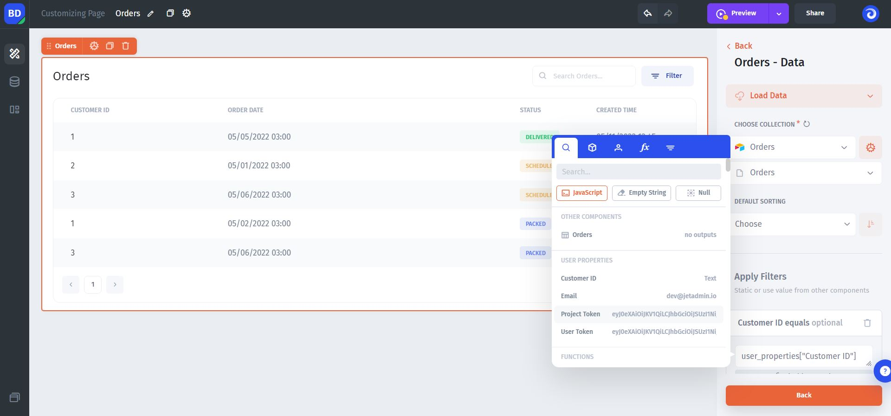
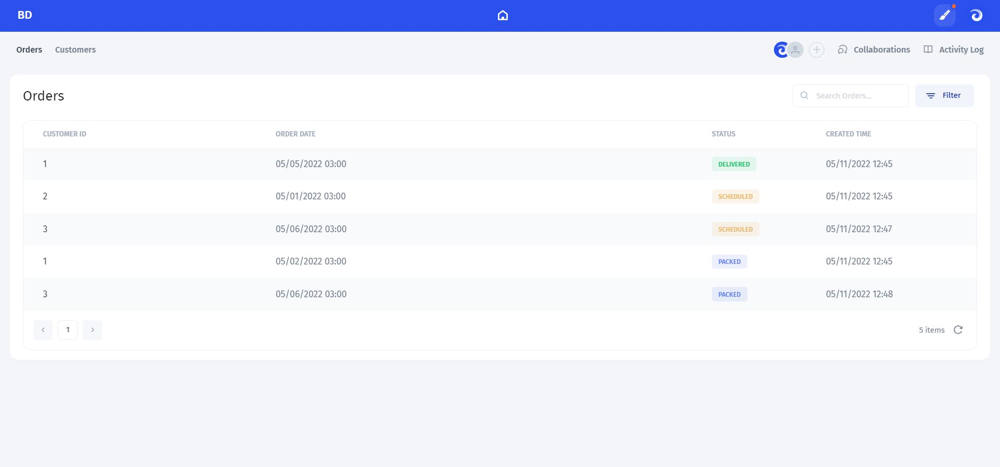
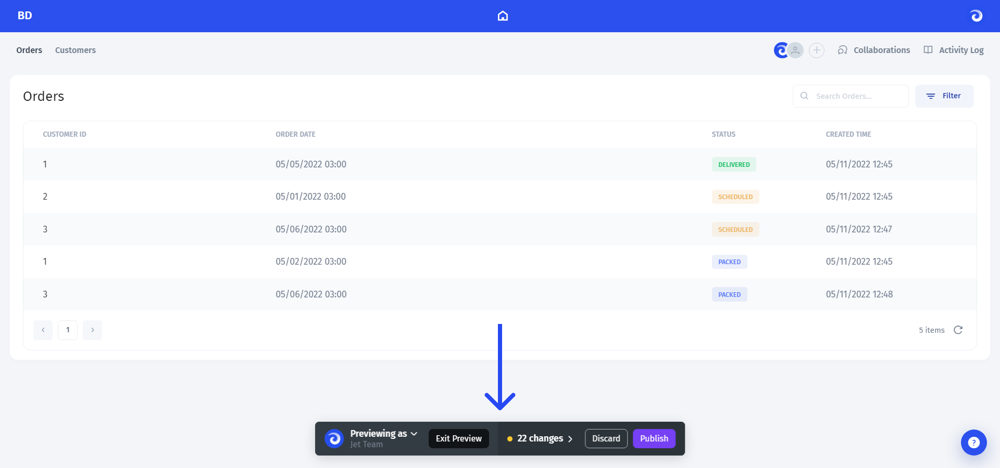
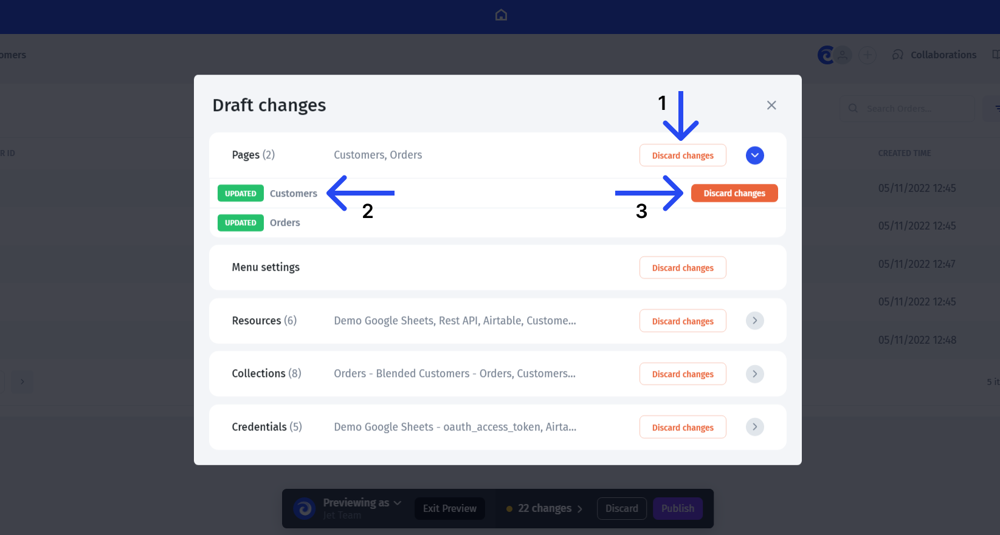
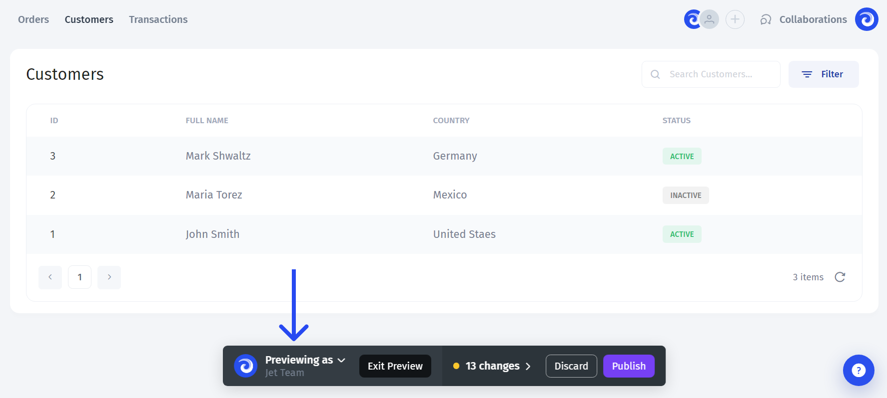

# Test, publish, and maintain

Applies to **Classic App Builder**. Screens and recordings in this section show the Classic interface.

Verify a Classic app's bindings, actions, and user access before releasing a change.

## Test an existing app

1. Confirm the app, environment, resource connections, and intended user role.
2. Check the changed component with populated, empty, and missing values.
3. Test a second selected record to detect stale bindings.
4. Run permitted actions on synthetic data and inspect the source result.
5. Test a restricted user and confirm denied operations leave data unchanged.
6. Preview the app, then follow its publishing controls and verify the published result.

Use [Troubleshoot a Classic app](troubleshoot-a-classic-app.md) if a check fails. For shared release practices, use [Publish & Deploy](../../jet-bridge-deployment/overview.md); for permissions, use [Access & Governance](../../access-and-sharing/app-and-data-permissions/).

## Classic mode and publishing reference

The following screenshots describe the Classic Builder, User, and Preview modes. These controls differ from the AI builder's Version History panel.

## Builder/User/Preview modes

There are three operational modes in Jet Admin: the **Builder mode**, the **User mode**, and the **Preview mode.**

## **Builder Mode**

**Builder mode** is where people who are building an app can add data sources, drag-and-drop UI components, customize them, bind them to your data, manage environments, and perform all the necessary work to get your app ready.


Use an account with the builder access required for the app you maintain.


## **User Mode**

**User mode**, on the other hand, allows end-users to perform their daily operations in the app. For that, all the changes that have been made in the app have to be published, generating a new page with a new `.../app/...` URL. In this mode, users don't have access to any customization features but can interact with the data according to their permissions.

## **Preview Mode**

**Preview mode** is designed for the builders to quickly preview the app in a user-mode without having to publish an app.

Within the preview mode, a user can:

* **Review** the changes before publishing
* **Discard** changes (will revert back to the last published version)
* **Publish** an app
* **Impersonate** a specific user

### Reviewing changes

By clicking on the **"N changes"** label, drill down into the changes history. Here you can view the logs **(2)** and granularly discard changes for broader categories **(1)** or for individual collections, resources, settings, etc. **(3)**

### Impersonating users

When building an app, it's usually difficult to get the right idea of how page permissions, dynamic filters, or conditional visibility that's been configured will transform into the end-user experience.

The impersonation feature allows you to quickly **preview** an app **through the eyes** of a particular user. In the example case below, we've denied access for Michael to the `Customers` page and set the user to see only records where `Customer ID = 1` the `Orders` table.

.gif>)

To start previewing as a particular user, just click on the "Previewing as" button, and choose a user to impersonate

