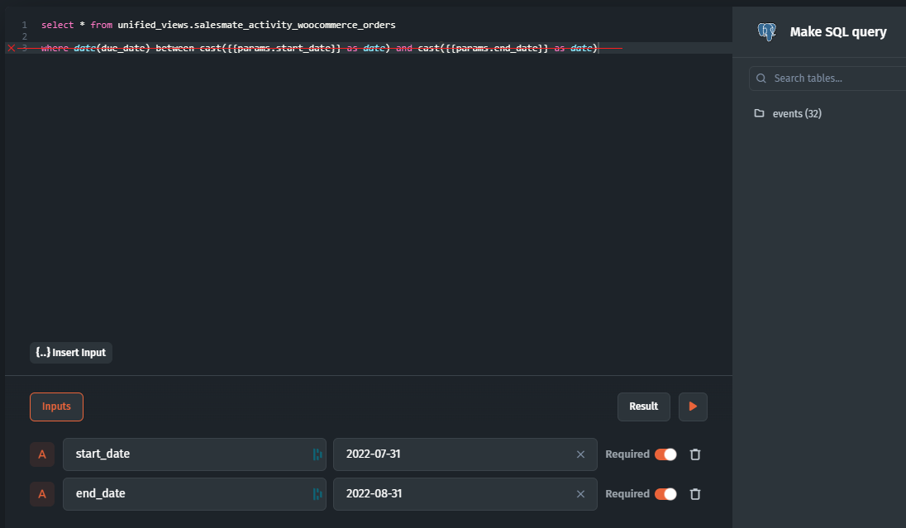

# Data is not loading

If your data is not loading, there might be many potential causes for this. This might as well render differently in the UI component: the infinite load, or the error.

In this article, we'll review the most common causes of this issue and help you identify and fix the problem.

#### Case 1 - VPN

A user supposedly hasn't changed anything but started to get this error:&#x20;

<figure><figcaption></figcaption></figure>

**Solution:** Disabling VPN solved the problem - this is the most common reason for such an error. After disabling it, reload the page.&#x20;

Case 2 - SQL query filters

In this case, a user wanted to display a filtered collection from a custom SQL query but got the "Nothing found" message

<figure><figcaption></figcaption></figure>

Even though the query was correct, it didn't account for the fact that Jet handles filtering automatically, so you **should not** add the `WHERE` clause.

<figure><figcaption></figcaption></figure>

**Solution:** omit `WHERE` and only set up the inputs and reference them in the query.
