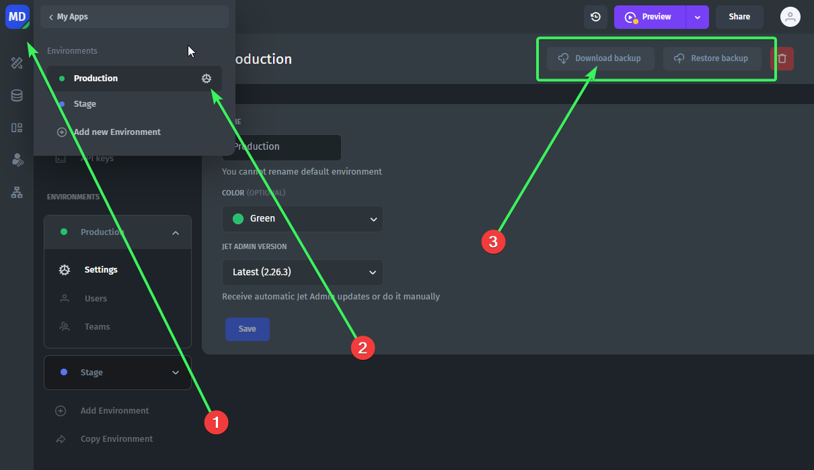

# How to clone the whole app?

If you want to duplicate your app, you can save your progress as a backup to a file, create a new app, and restore your app from a backup. Please be aware that created actions won’t be copied, you will need to add them manually.

Go to MyApp in upper right corner -> Environment -> Settings -> Download backup

<figure><figcaption></figcaption></figure>

After that, create a new app and go to the Environment -> Settings to restore your backup.


Please note that Actions from your original app won’t be copied


