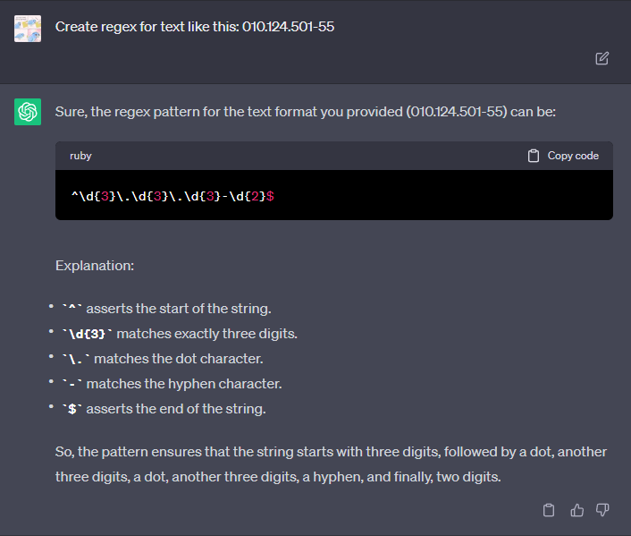
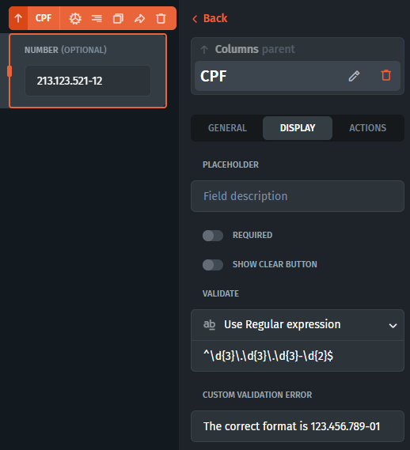

# How to restrict input in a text field?

If you want to allow an input to only receive a certain number or text format, you can use regular expressions.

For example, let's say that you want your input to receive an ID number that is structured like this: “010.124.501-55”. If you don’t know how to write regular expressions, you can simply ask any AI bot to do this for you, [ChatGPT](https://chat.openai.com/) for example:

<figure><figcaption></figcaption></figure>

After you get your regular expression, you can input it in the validation field of your component. Click on the component in builder -> Display tab -> Validate -> Use Regular expression

<figure><figcaption></figcaption></figure>

You can also mention your field format in the custom validation error field for easier understanding. 
