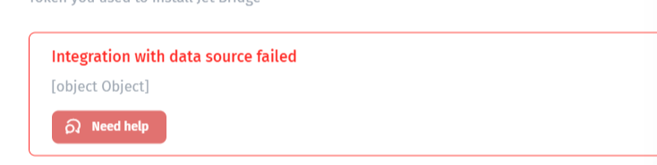

# Troubleshooting Django integration

If you are having trouble connecting Django to JetAdmin, you will need to check a few things:

* Make sure there are no network restrictions.
* Check whether your Jet Bridge is the latest version.
* Check your CORS policies in Django.

If your network with Django is okay, and you are using the latest Jet Bridge version but still getting errors like this:

<figure><figcaption></figcaption></figure>

<figure><figcaption></figcaption></figure>

That means that you need to check your CORS policies in Django.

By default, there is a parameter in Jet Bridge for Django that contains CORS in settings.py called "JET\_CORS\_HEADERS".

It is enabled by default and filled automatically, but if your Django already has an app called “corsheaders” then it turns off. You can configure your CORS settings in the "corsheaders" app instead.

Alternatively, you can try to force "JET\_CORS\_HEADERS" to be set to True, but it can lead to strange effects, so we would advise trying it only as a last resort.

\
 
