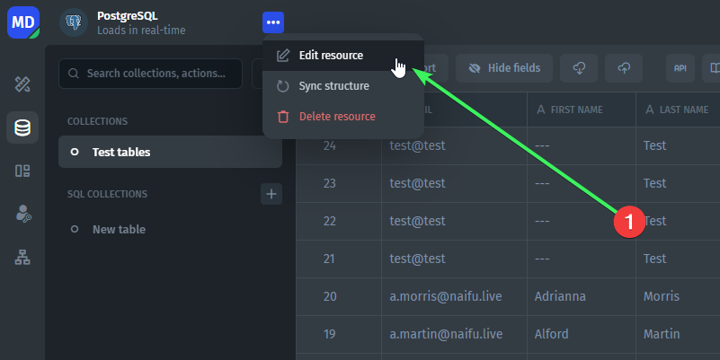
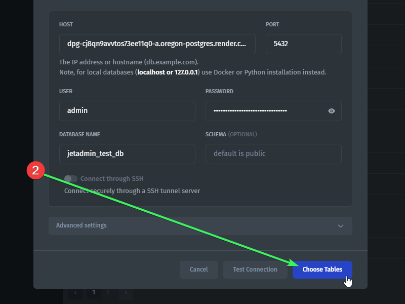

# Why new SQL tables are not showing?

If you've added new SQL tables to your database, you will need to manually select new tables to load into JetAdmin.

Go to Data -> _Your Resource Name_ -> Three dots -> Edit resource

<figure><figcaption></figcaption></figure>

Scroll down and click on "Choose Tables"

<figure><figcaption></figcaption></figure>

You will see a list of your tables there. You’ll need to click on checkboxes of tables that you want to add and then click on "Update resource".

 
