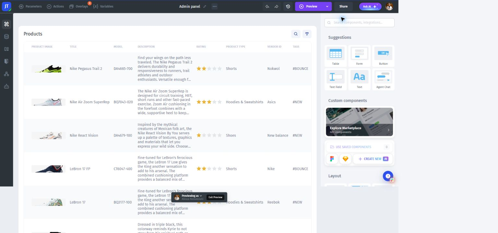

# Choose AI or Classic App Builder

**Prompt Assistant** is the starting point for a new app. Describe a task and the connected data, review what it builds, and request changes in plain language. Follow [Build your first app with AI](start-here.md).

AI app creation starts with a description of the app you want.

**Classic App Builder** is the drag-and-drop editor for existing apps. Its guides cover pages, components, binding, variables, JavaScript, and visual design. Use Maintain an existing Classic app for changes to a Classic project.

Classic apps use a visual canvas and a component palette. The example shows a product table.

Both modes can use Jet Admin data sources, workflows, access rules, and publishing features. Before changing a live app, test any generated queries, actions, and permissions in a separate environment. If you are moving a workflow from Classic to AI, start with one task and compare the result rather than treating the prompt as a complete specification.
