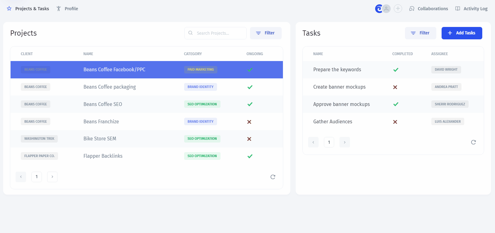

# 👥 Creating a Customer Portal

### PM Portal in 5 mins 🚀

As an example, we'll build a Portal for a Consultancy agency's corporate clients where they can `View` their **Projects**, `Edit` the related **Tasks**, and `Update` their **Profile:**

To build the portal, we start with **preparing the data**:


[prepare-your-data.md](prepare-your-data.md)

