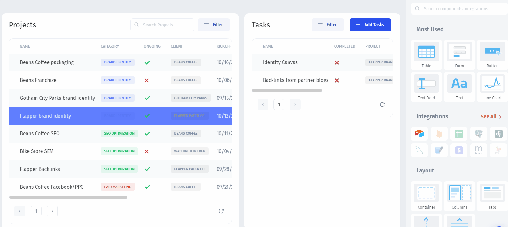
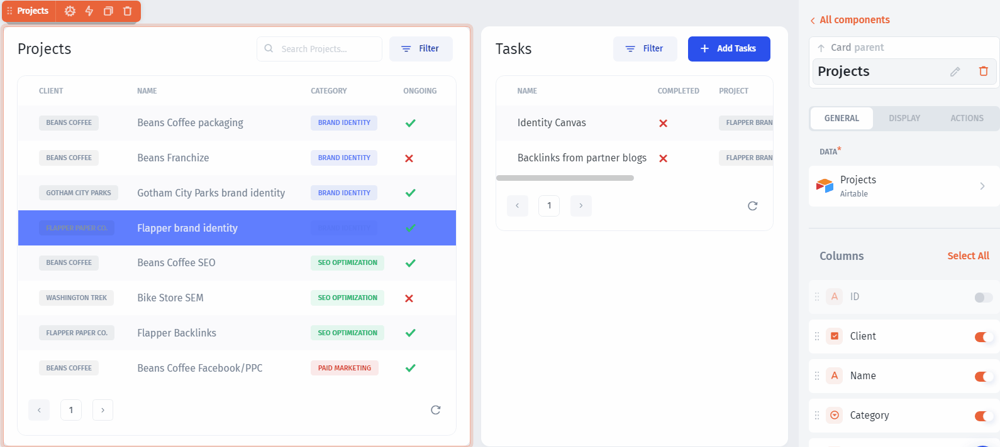
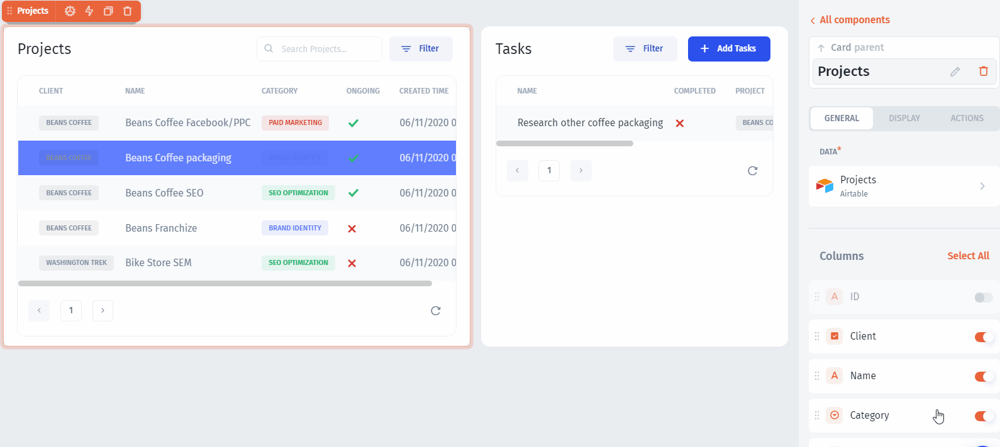
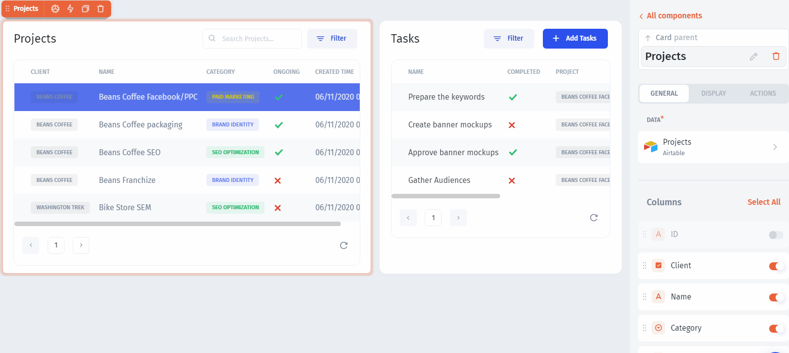

# Customize your Portal

In Jet Admin you can **customize the appearance** of your Portal for better usability. Let's start with the `Projects` table.

**Disable** unnecessary columns and **rearrange** the order:


In Airtable, field types are detected automatically, but for other data sources you might need to configure them by clicking on the **column icon**


Let's now set the number of **displayed rows** to **5**, and make the first row selected by default:

You can change the **field types** to render different fields differently and customize their appearance. Just click on the icon, choose the right type from the dropdown, and configure it:

In Jet Admin, you can configure and customize **any component individually on any page**. Let's make our record fields non-editable so that the users will be able to change only the `Deadline` date:

Applying similar edits to the `Tasks` table and we're done with the UI customization:

.png>)

Now, let's invite external users and make them interact **only with their data:**


[invite-users.md](invite-users.md)

