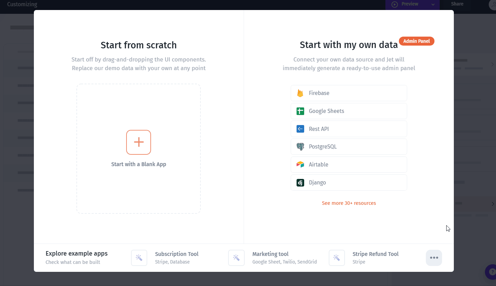
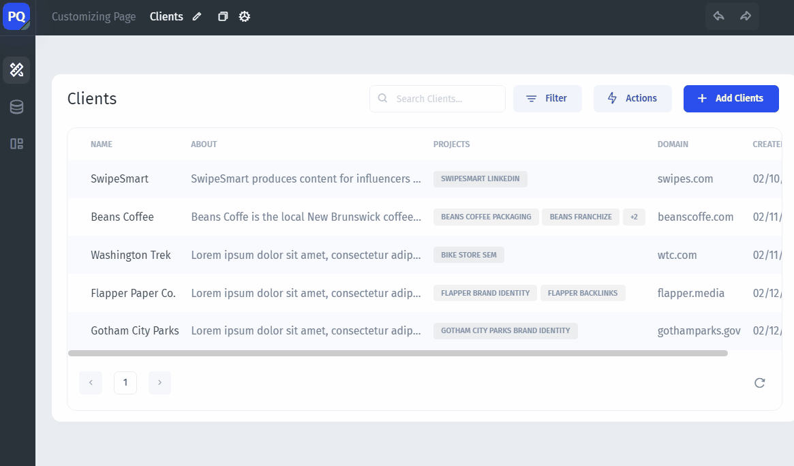
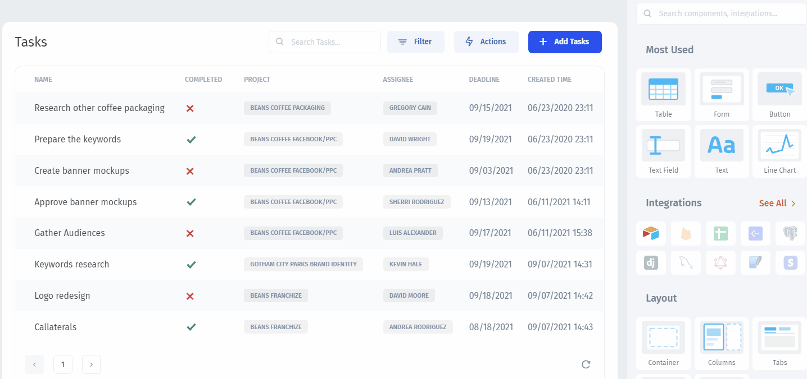

# Generate the App

### Connect your Data Source

After creating a project, you'll be prompted to start with Blank app or with your Data. Select the Data Source of your choice and fill in the credentials, then finish the process:

### Choose the Page

You can **navigate through** pages and **create new** pages in the `Pages` tab on the **** top left. Now,  let's pick another page:


When you connect a Database, Jet Admin automatically **generates an app** based on the pages you selected in the previous step


Now let's **test** how it works by&#x20;

1. Clicking on the `Table` to select it
2. Clicking on a `Row` to drill-down to the record view

Next, let's set up **the Layout**:


[set-the-layout.md](set-the-layout.md)


