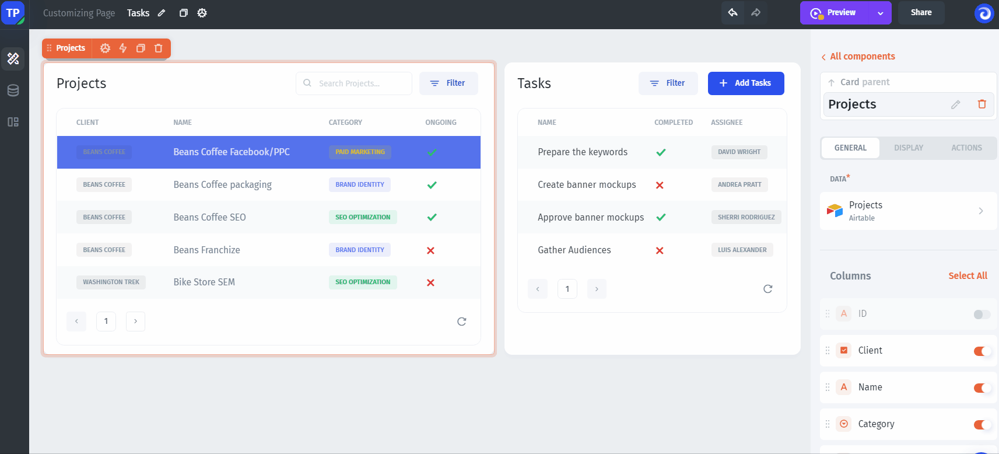
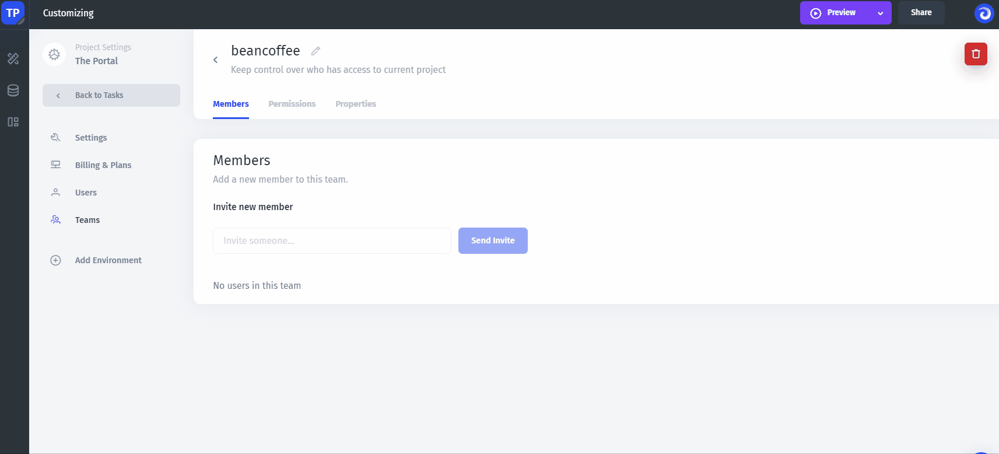
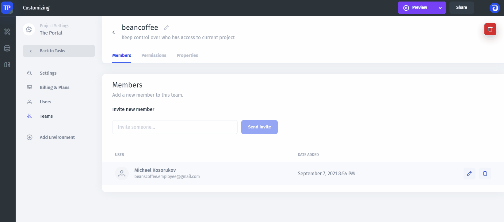
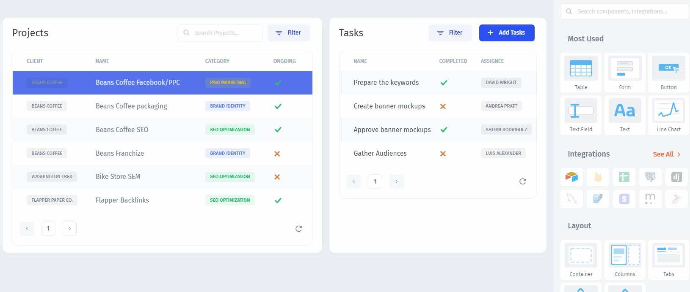
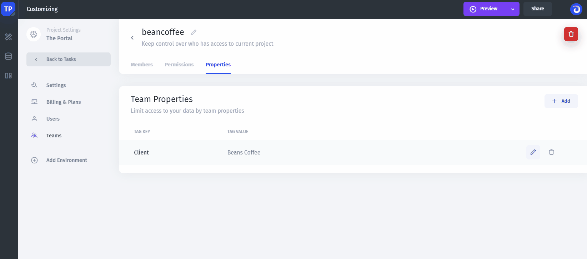
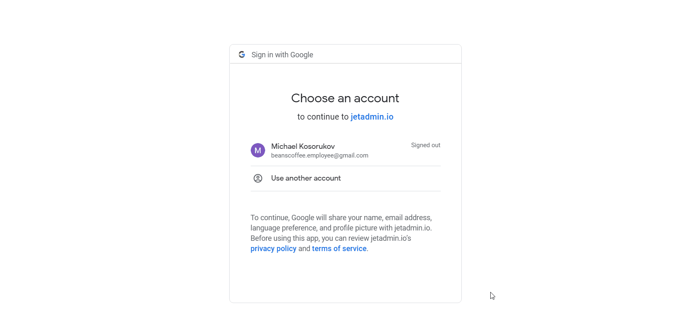

# Users & Permissions

The key functionality of any Portal is that any user or groups of users see and interact **only with their data**. In this step, we'll invite our users and set permissions to turn our Airtable app into a **secure portal**.

### Invite Users

Click `Share` and add the email of a user. Then we can invite this user to the existing team or create a New Team by clicking `Add a new Team`. In our example, we build a portal for corporate clients, so we'll create separate teams for every company we work with.


In Jet Admin, **Teams** are the groups of users with the same permissions


Then **send invites** to the users. In our case, we invite Beans Coffe employees:

### Set the Data Separation

**Team Properties** and **User Properties** are used to set the data separation in Jet Admin. For each team or user, we add a `Property` that uniquely identifies a company or a client, such as `domain` or `email`. In our case, we use the company name:


To be able to separate data, we need to have the property value in our data


Next, we need to **filter** our Portal's data by the property. Select the component you want to separate data for, proceed to filters, and set the `Client field` to match `Client property` we've created:

### Set Permissions

Additionally, we want our Coffe Beans employees to interact only with the portal page we've created. For this, go to the **Teams** and set page-level permissions to allow access to the `Tasks` , `Tasks-edit` and the `Tasks-create` pages:

Now, let's check how that works: the Beans Coffee employee that we've invited can see **only their company's projects**:

