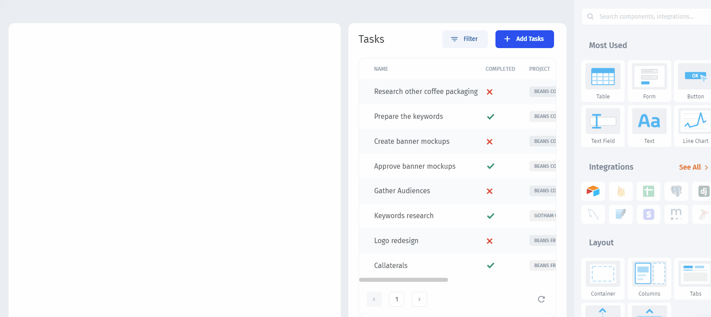
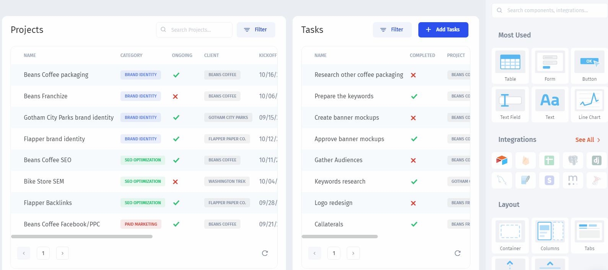
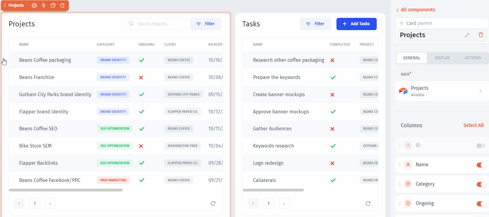

# Link Related Tables

You can **link different tables** as long as there's a common field in both of them. In our case, we'll link by the `Project name` field.


In Jet Admin you can link tables from **different Bases**


### Display the Projects

Drag the `Table` component and change the mock data to your own. Select the data source you've connected and the page you want to display:

### Link the Tables

Each `Project` has many `Tasks` and we want to see the list of `Tasks` for a given `Project`. To create this flow, we need to **dynamically filter** the `Tasks` table by the `Project name` value, obtained from the selected row in the Projects table. For this, Jet Admin has the **Formulas** modal window, where you can map the components:

And we've got our tables **linked**:

Now, let's **customize** our Portal:


[customize-your-portal.md](customize-your-portal.md)

