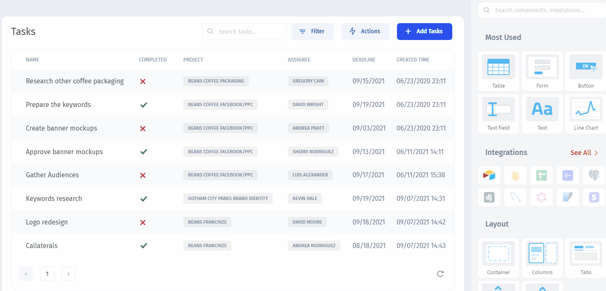
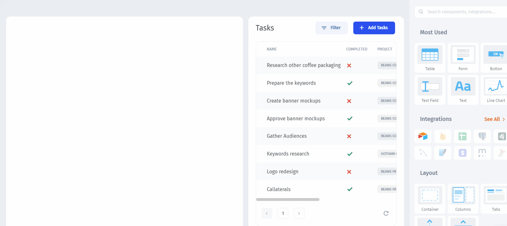

# Set the Layout

Jet Admin provides the library of pre-built **UI components**, such as `Table`, `Map`, `Gallery`, or `Charts` that you can **drag and drop** to display your data. As well as the `Layout` components that are used to assemble other components on the page.

### Set the Layout

`Columns` are used to set the horizontal component of the layout. You can add multiple columns and resize them:

We also can change the position of the individual fields in the record view. For that, drill down into the record and drag and drop the fields you want to reassemble:

Now, let's add our `Project` table and link it to the `Tasks` table:


[link-related-table.md](link-related-table.md)

