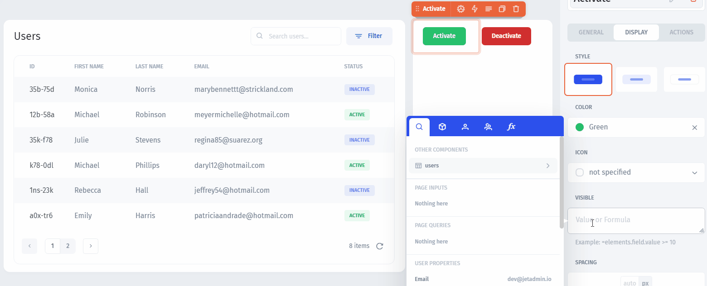

# Conditional Visibility

In Jet Admin, you can make certain components visible or invisible depending on the values or combination of values from your data or user attributes.&#x20;

Say, we want to show two different status change `buttons` depending on the status value of the selected row of the `users` table:


If standard permissions are not enough and you may want to **restrict access** on the level of **individual UI components**, use [user properties](../../user-guide/security-and-privacy/user-and-team-properties.md) in the visibility logical expression


To achieve that, let's first drop **two buttons**: one that changes the status of a user to "active" and the other that changes it to "inactive":

Then, we proceed to the "Activate" button's settings to the **"Visible" section**:

Next, we type in the condition: `IF` the `status` value from the selected row equals "inactive", then return `true`, otherwise, return `false`. Returned `true` will make the component visible and `false` will make it invisible:

Here's the expression: `=IF(EQ(elements.users["0"].selected_item.Status, "inactive"), 1, 0)`

Then we do the same for the "Deactivate" button, grabbing the "active" value from the selected row:

`=IF(EQ(elements.users["0"].selected_item.Status, "active"), 1, 0)`

And we get our buttons being **dynamically hidden** based on the status value from the selected row:

