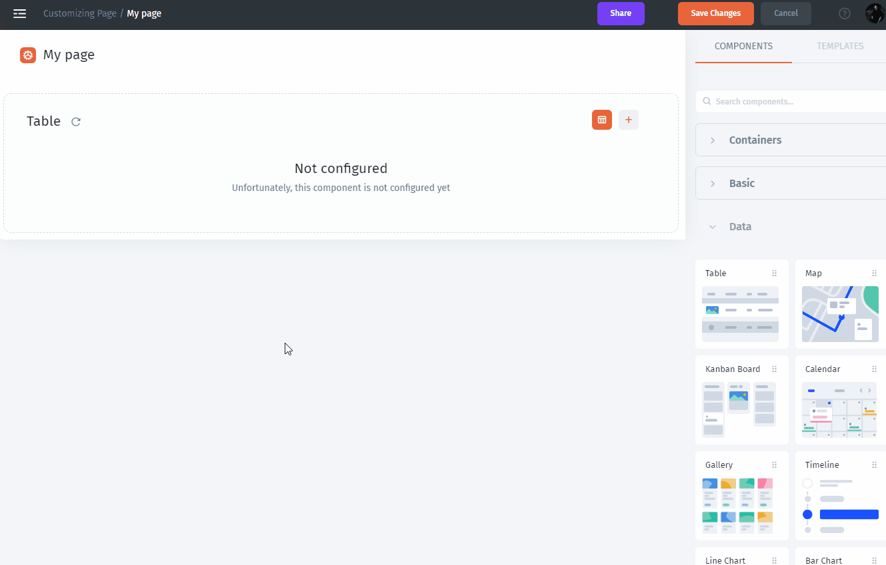
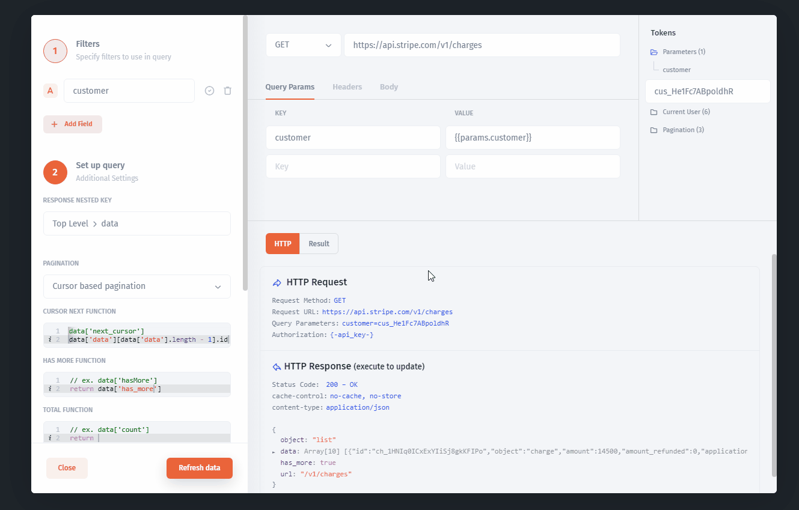

# Reading data from API

For instance, you need to make your own API request, just choose `Make an HTTP request` as an operation. Let's look at an example of how to get a list of transactions. We are going to display a list of transactions in the table component with the Stripe API (you can use any API).&#x20;

### Make an API request using API Builder

1\. Go to the Component Settings then `Add Data Resource`

2\. Select a resource then choose collection as `Make an HTTP request`

### Pass API parameters

Now you are in API Query Builder. Specify `endpoint` and add new `customer` parameter (to return charges for the customer specified by this customer ID)

### Use tokens on your API request

When you create a new parameter it becomes available as tokens. You can set a value for the parameter to request a list of customer's transactions.

### Transform your response

To transform the response, use the `Response Nested Keys` to specify the result of your request:

### Paginate by pages

To paginate by the list of pages specify `cursor pagination` :

1\. Select `Cusror Pagination` as `Pagination`:

2\. In general, `Cursor pagination` is specified by `next_cursor`, `has_more` parameters. To parse the response we use Javascript notation. You can modify your function's return value by adding a transformer. Use the identifier `data` for the return value and enter any expressions to modify the result, such as add a property or loop over the data set.&#x20;

* `next_cursor` as `data['data'][data['data'].length - 1].id` &#x20;
* `has_more` as`data['has_more']`

3\. Let's specify the request by providing `Query Params`:

### Run your request

Simply click `Refresh Data` button to run your request


[make-an-http-request.md](../../user-guide/data/make-an-http-request.md)

