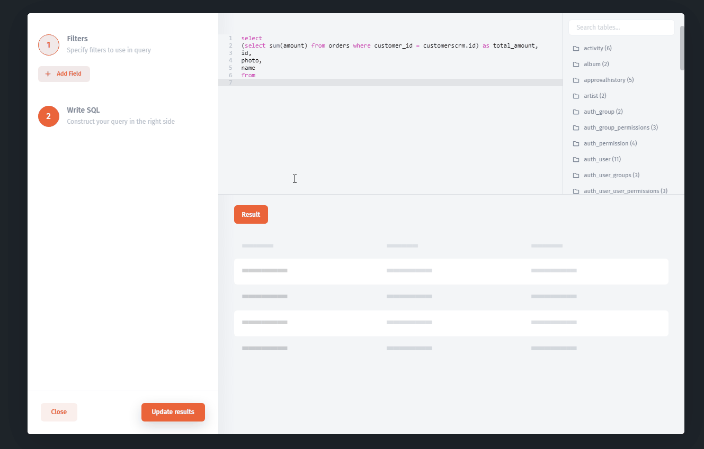

# Reading data from SQL

Let's say, we need to display order total amount on `Customer` table for each customer. All Orders we stored in the separate `Orders` table in the SQL database.&#x20;

The result`Customers`table contains: `customer_id`, `photo`, `name`, `total_amount`columns of data for each customer.

### Build SQL query using SQL Builder

1\. Go to the Component Settings then `Add Data Resource`


2\. Select a resource (SQL database) then choose collection as `Make an SQL request`


### Write SQL query

Let's write a SQL query that returns customers includes the total amount column:

```sql
select 
(select sum(amount) from orders where customer_id = customerscrm.id) as total_amount,
id,
photo,
name
from 
customerscrm
```


### Tips

Here is a list of your available tables, you can see the table columns. You can use them while writing SQL, just click on the table name and the name will be automatically added.



### Run your SQL query

Simply click `Update Result` button to run your SQL command.


### Customize table

Just close SQL Query Builder to start to customize the result table.



[make-a-sql-query.md](../../user-guide/data/make-a-sql-query.md)

