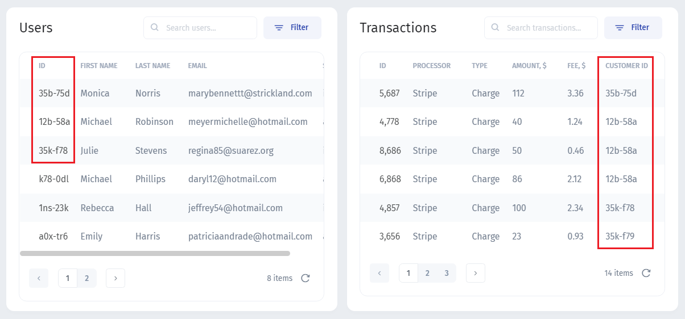
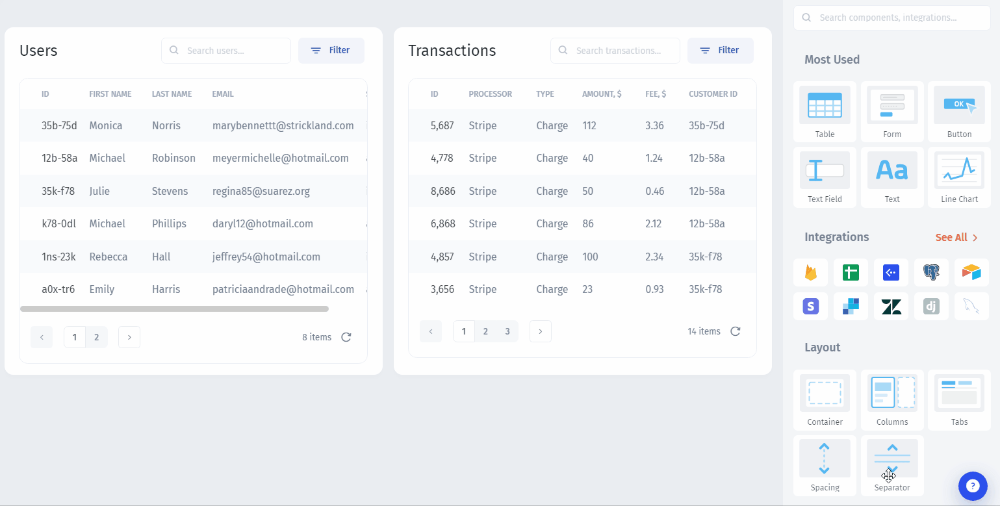
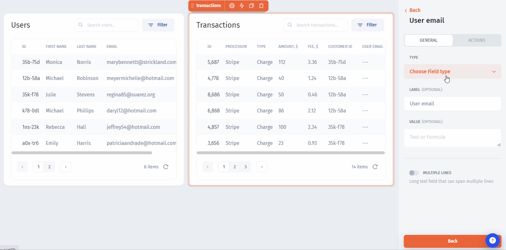
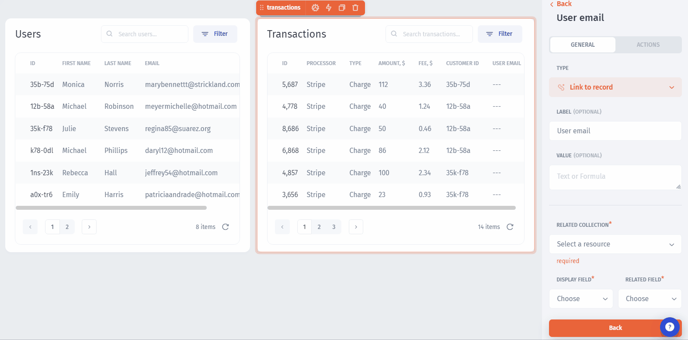
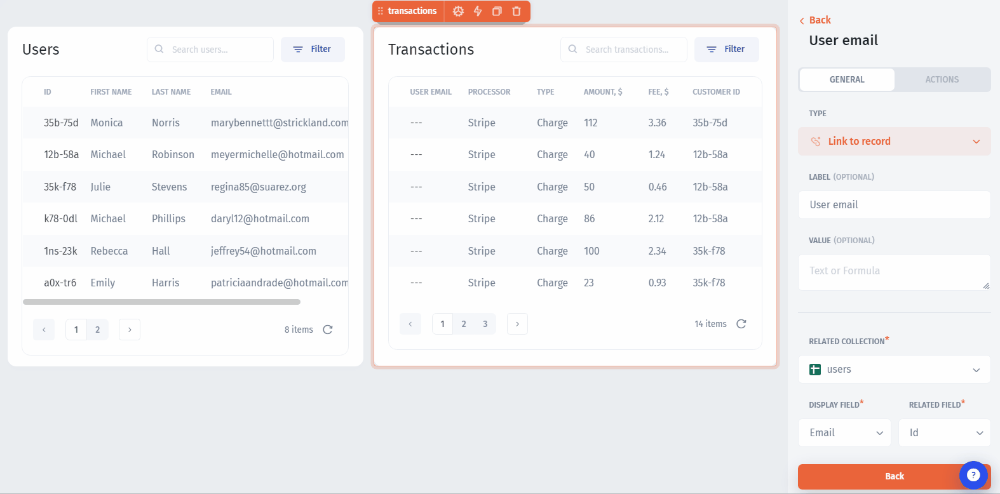

# Single relations

**Single relations** help you fetch data from the **related collections**.&#x20;

To illustrate how it works, let's imagine we have the `Transactions` table that doesn't contain a **customer's email** and the `Users` table that contains the customer information including the email:

.png>)

And we want to **display the email** in the `Transactions` list:

.png>)

First of all, we identify how our tables are **related**: for each user, there are several transactions that are related to the users list by the **ID** and **Customer ID fields:**

Now, let's create a new **custom column** in the `Transactions` table:

Then change the **column type** to `Link to record`

Now, we need to select where we'll get the user email from (a related `Users` table), what field in the `Users` table is used to set relations with the `Transactions` table (the `ID` field), and what field from the `Users` table we'd like to display (the `Email` field):

And the **final step** is to get our custom field value from the `Transactions` table field that sets relations to the `Users` table (the `Customer ID` field):

Now, let's make UI components **dynamically visible** based on a rule:


[conditional-visibility.md](conditional-visibility.md)

