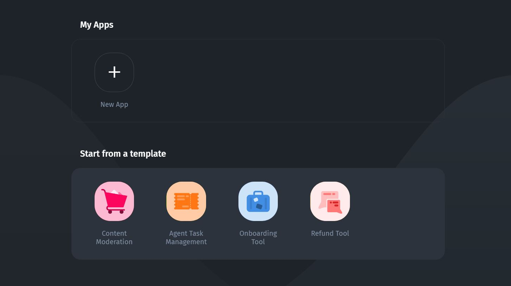

# ⚡ Quickstart

👉Before we jump into the thick of it, there is one thing that needs to be **clarified**:

### Internal Tools vs Customer Portals

Both **Client Portals** and the **Internal Tools** are the same in their essence - they are just web or mobile apps built on Jet Admin. However, they differ from the usage perspective: `end-users` of the Portal are **external users**, e.g. Vendors, Partners, Merchants, or Individuals, whereas `end-users` of the Internal App are **internal users**, i.e. your organization's employees. They also differ in [pricing](https://www.jetadmin.io/pricing/).

Typical use-cases for the Client Portal and for the Internal Tool also differ, that's why we've created two **separate quickstart journeys** based on the common use-cases:


[quickstart](quickstart/)



[creating-a-customer-portal](creating-a-customer-portal/)


If you want to save time building your app, you can apply one of the **templates** that you can find on the dashboard. You can preview the templates [**here**](https://www.jetadmin.io/templates).


It's crucial to correctly **bind your own data** to UI components composing a template later on. Learn more about it in the [**Values**](../user-guide/parameters/) section.

