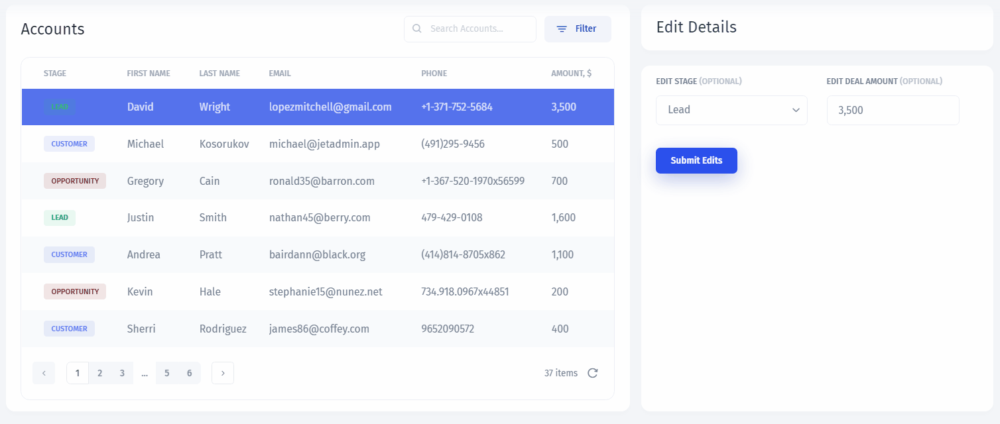

# 🛠 Building an Internal Tool

### Custom CRM in 10 mins 🚀

To familiarize yourself with how Jet works, let's build a simple CRM that will allow us to `View` and `Edit` the Customers:

We'll go through the whole **process of creation** step by step. Let's start with our data:


[connect-your-data.md](connect-your-data.md)


