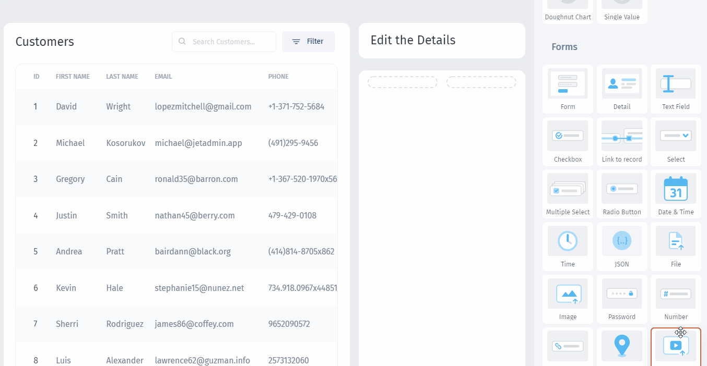
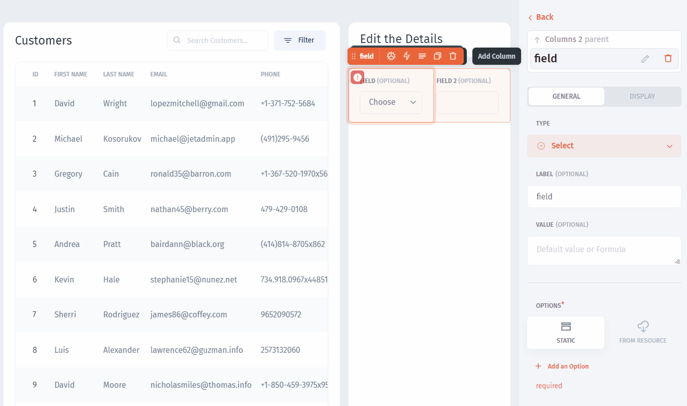

# Add Input Fields

To be able to **receive values** from the app's users, we can utilize one of the `Forms` components. These components can be used to provide input values for actions or to filter other components. We'll drag the `Number` and the `Select` components:

For certain components, such as the `Select` component, **additional customization** is required:

Next, we need to link our `Table` to the `Input fields`:&#x20;


[link-components.md](link-components.md)


