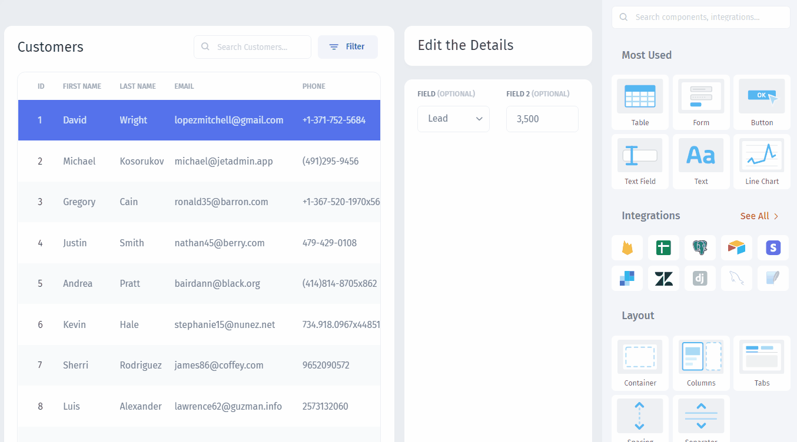
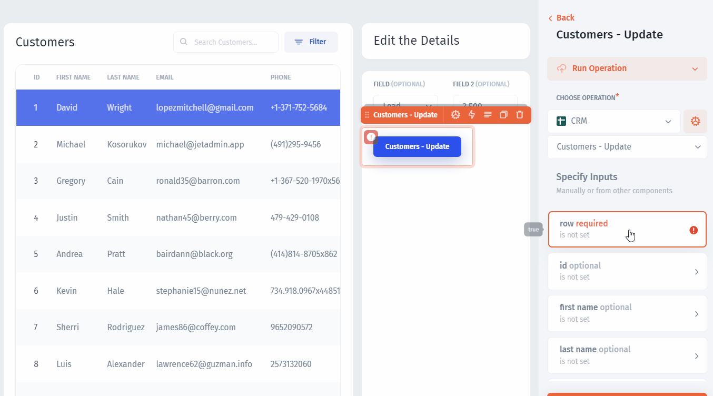
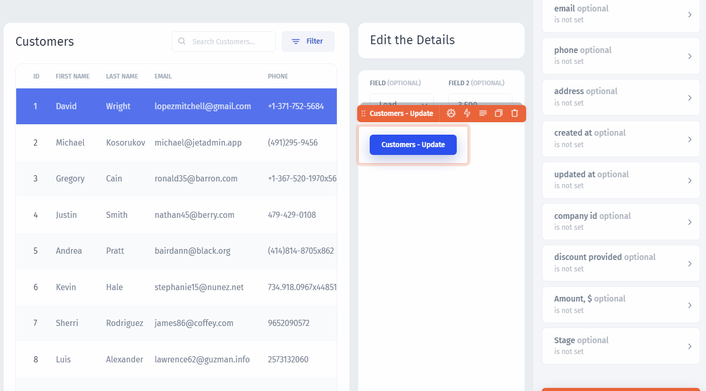

# Configure an Action

There are different sorts of **actions** that can be set in Jet Admin: `update a record`, `create a record`, `mass-delete`, `export`, custom `SQL/API queries`, and more. Every action can be triggered by `buttons` or components' functions, such as `row click`.

For our case, let's drag and drop a `button`, select `Run operation` then select the **data source** and the **collection** you want to update:


When you connect databases, Jet Admin generates all the **CRUD operations** automatically, so you need only to choose the right collection and the right type of operation


Now, we need to specify all the fields for the `Customers-Update` operation. First of all, we need to set which record our button will update - for that we'll get the row value from the `selected row` of the `Customers` table:


Depending on a data source, the **identification field** might be different: `Id`, `Document path`, `Document ID`


Next, we need to obtain the `Stage` and the `Amount` values from the `Input fields` - thus providing the editing functionality in the app:

The next step is to customize or app's **appearance**:


[customize-your-app.md](customize-your-app.md)

