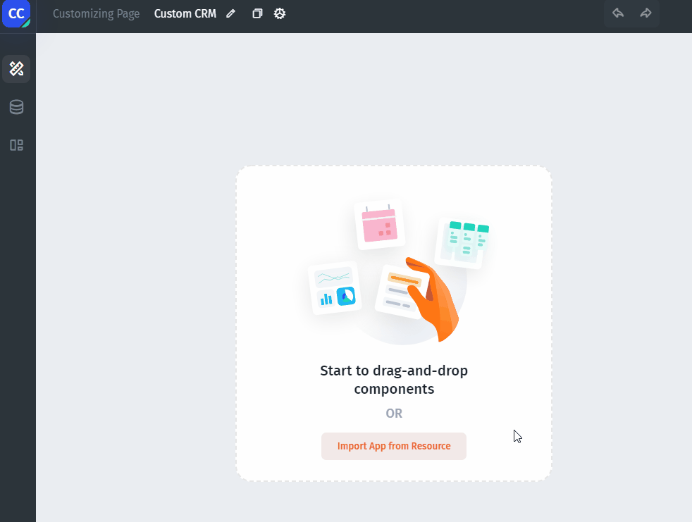

# Connect your Data

You can build apps with your data from pretty much **Any Data Source**: `Firebase, Sheets`, `Airtable`, `Stripe`, `REST API`, and so on. We'll use Sheets in our example:

.png>)


Your data source can not be empty, fill it in with mock data if necessary


### Connect the Data Source

Select the Data Source you want to connect and then follow the instructions:

Now, Let's set **the Layout** for our app:


[set-the-layout.md](set-the-layout.md)

