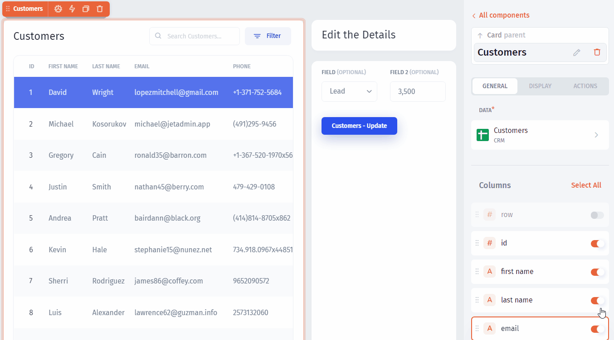
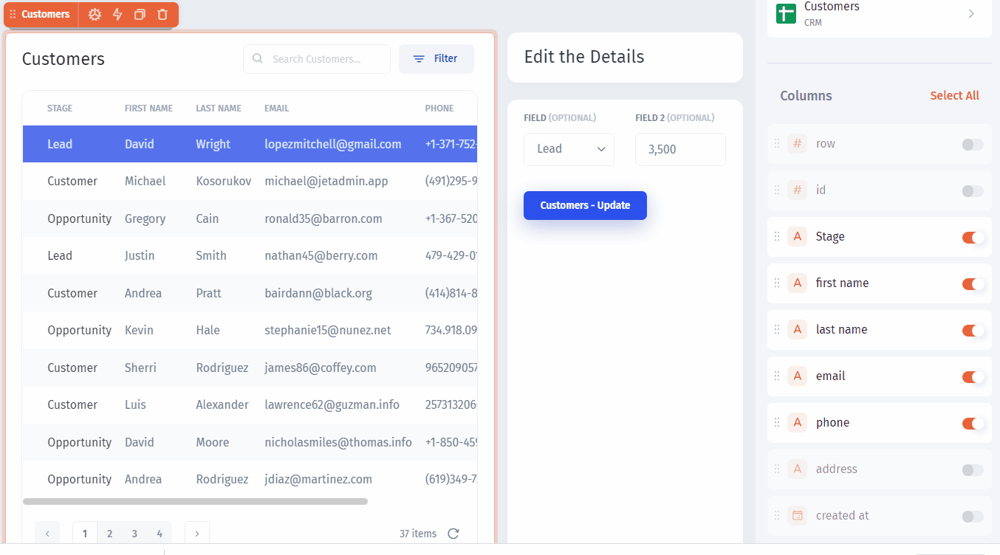
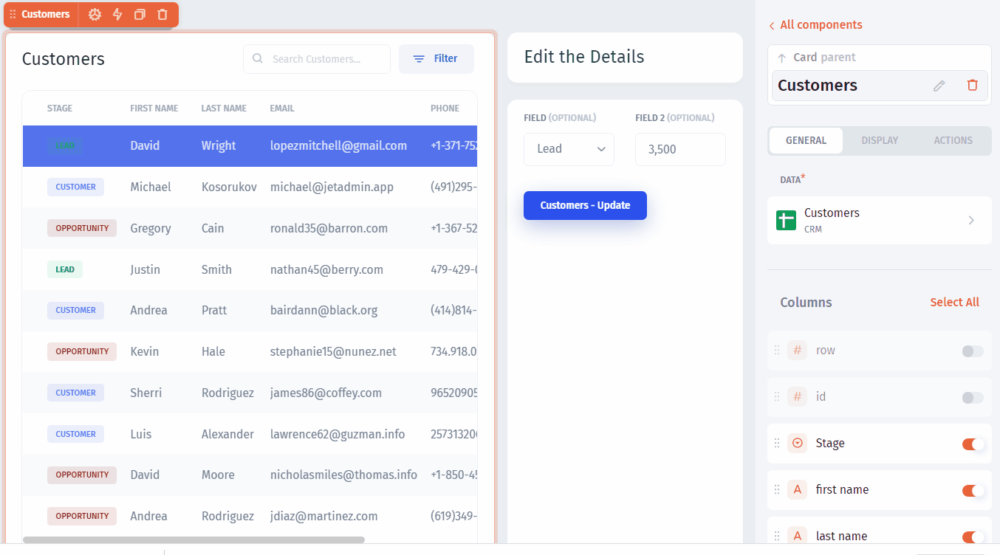

# Customize your App

In Jet Admin you can customize the appearance of your app for better usability. Let's start with the `Table`.

**Disable** unnecessary columns and **rearrange** the order:

You can change the **field types** to render different fields differently. Just click on the icon, choose the right type from the dropdown, and configure it:

Let's now set the number of **displayed rows** to `7`, and make the first row selected by default:

Then change the labels and we're almost done. Now it's time to **preview** and **publish** our app:


[publish-your-app.md](publish-your-app.md)

