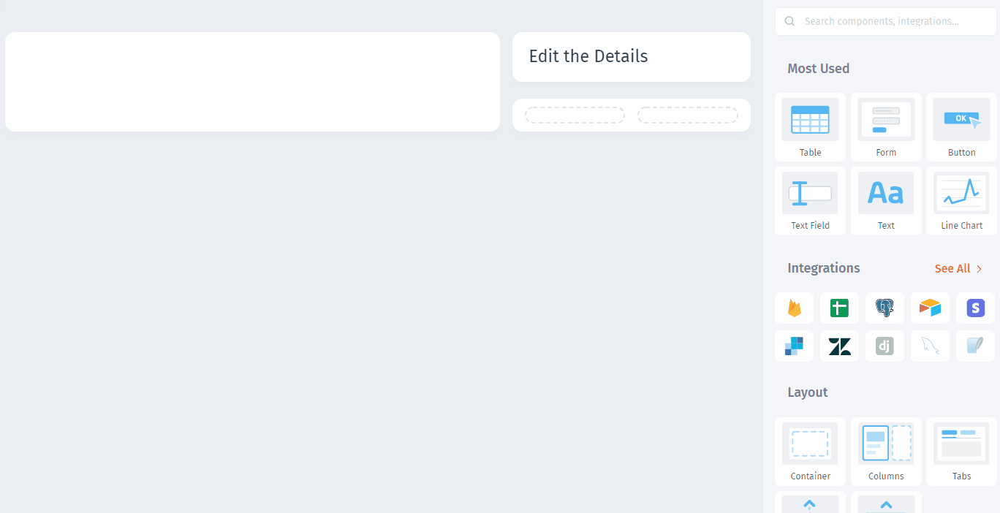

# Display Customers

### Display Customers

Firstly, drag and drop the `Table` component. Then select the **Data Source** that you've connected and the **collection** that you wish to display:

Now, give our users the ability to **edit data** through the input fields:


[add-input-fields.md](add-input-fields.md)

