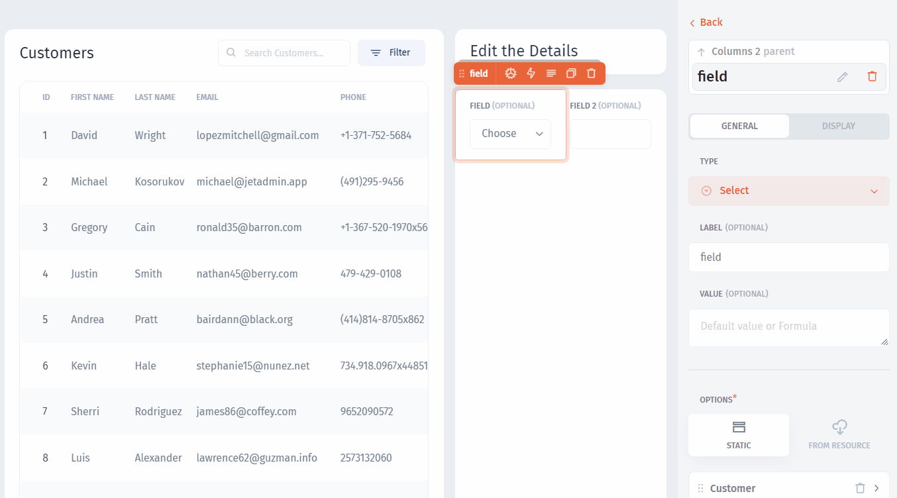

# Link Components

To create custom **user flows** in your app, you need to be able to pass values between components. For this, Jet Admin has the `Formulas` modal window, where you can map the components:

.png>)

In our example, we need the `Stage` and the `Amount` values to be fetched from the selected customer in the `Customers` table:

Now, let's set up an **action** that will `update` our customer record with the input values:


[configure-an-action.md](configure-an-action.md)

