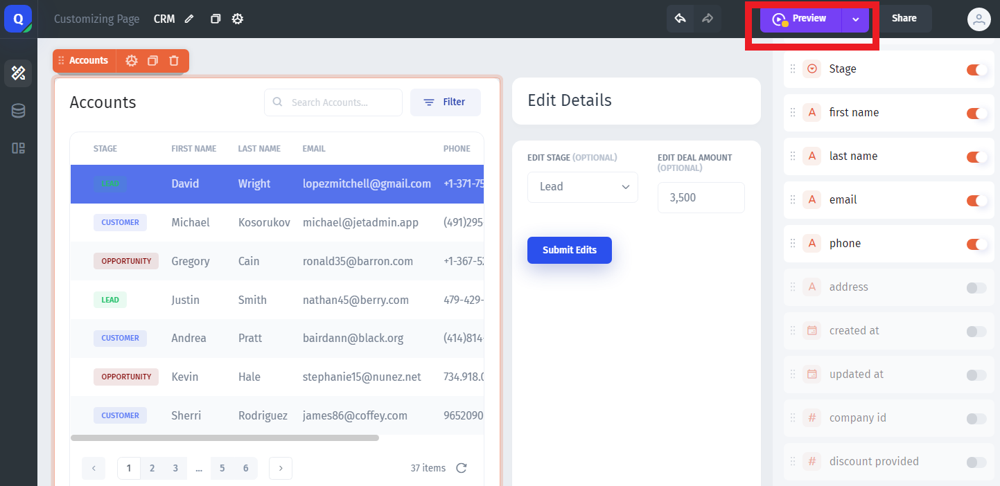
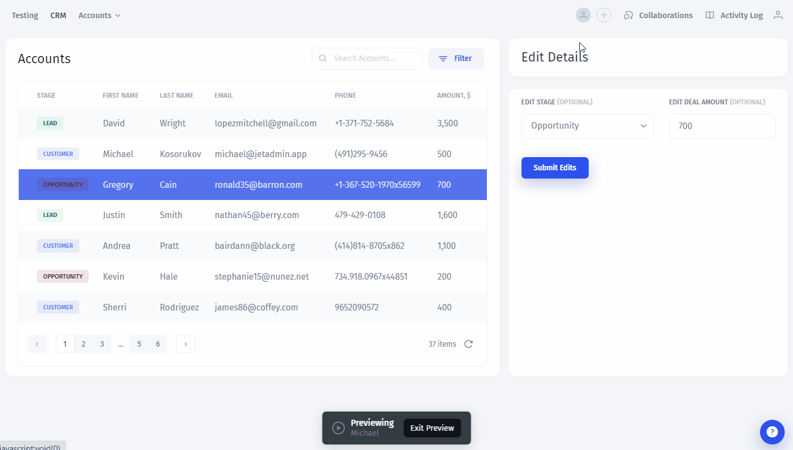
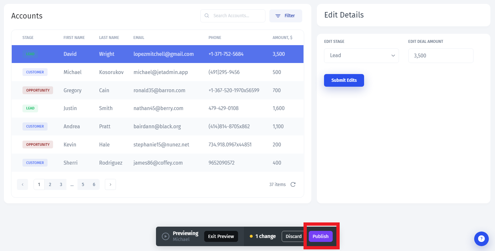

# Publish your App

After you've made the changes to your app, you can **preview it** to test and, if everything's right, **publish it**. To preview your app, click on the `Preview` button at the top:

Let's **Preview** how our app will look like in the **User mode** - the way the users of the app will see it when you share the access with them:

Next, just click "Publish" - this will **save all the changes** in the User mode:

Great! Now that we're done with the Basics, we can get to the **advanced functionality** of Jet Admin:


[part-2-intermediate](../part-2-intermediate/)

