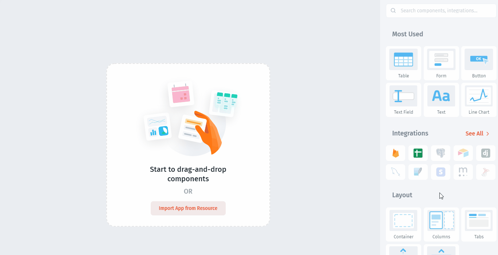
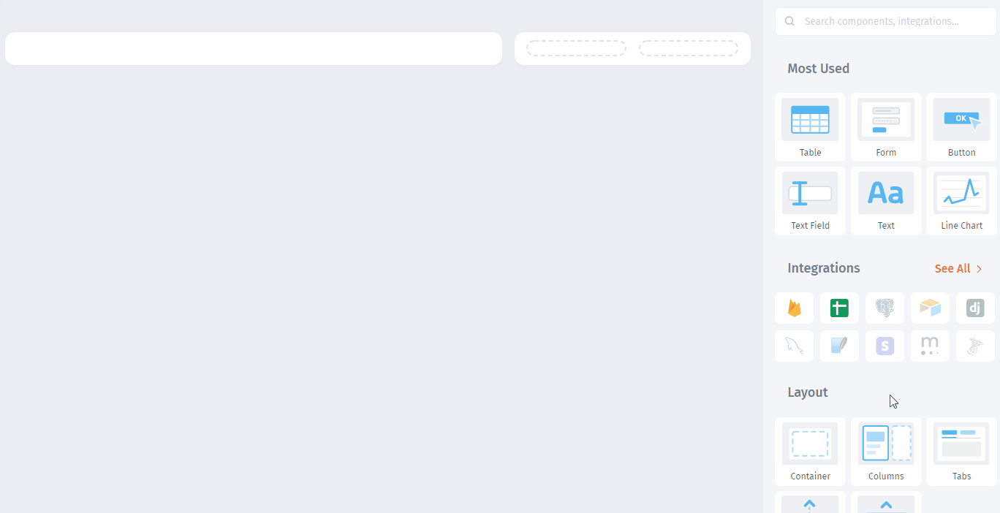

# Build UI

Components are prebuilt UI elements your users engage in, such as `Tables`, `Forms`, `Buttons`. In this example, only a limited number of components are used, you can explore 50+ Components in the UI Component Library. Drag-and-drop components within **Layout** `Columns`, `Tabs`, and `Modals`, facilitating the building of your app.

The app you're going to build will allow you to create/update Deals data. To enable this functionality, you'll add `Table`, `Forms`, and `Modals`. Learn more about [Jet UI Concept](../../user-guide/jet-ui/) in our documentation.

### Set the Layout

`Columns` are used to set the horizontal component of the layout. You can add multiple columns and resize them:

### Set the Title

You can use **static** components in Jet Admin, such as `Text` or `Image`. Text appearance can be adjusted:

Next, let's **display** our customers in the `Table` view:


[display-customers.md](display-customers.md)


