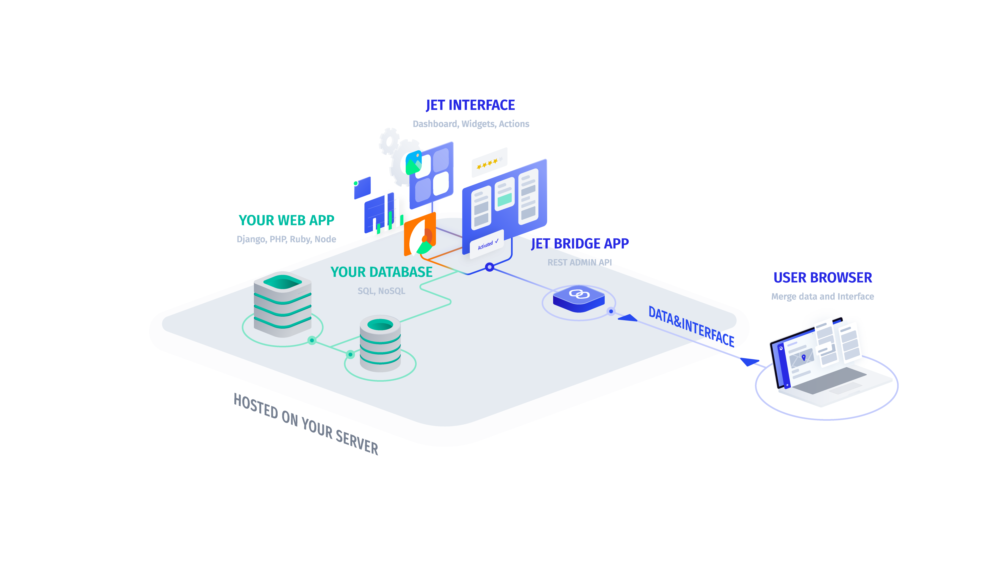

# On-premise

If you need to secure sensitive data, you can host Jet Admin on your own servers and block all network connections. You can place it behind your VPN, in your own VPC. [Contact Us](http://jetadmin.io/contact)


[deploy-on-premise-jet-admin-with-docker.md](deploy-on-premise-jet-admin-with-docker.md)

